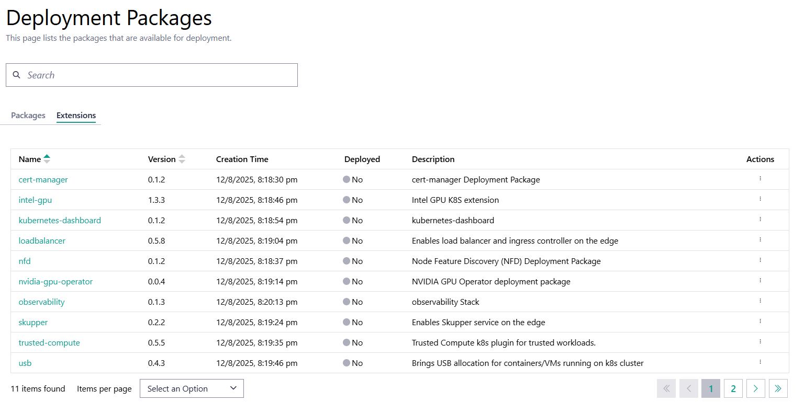

Deployment Packages
===================

Deployment packages and applications are a concept introduced in the
|software_prod_name|.

They are used to simplify the deployment of applications to the edge.
Deployment packages are a collection of applications and deployment
profiles. Deployment profiles are configurations that define how an
application must be deployed to an edge node.

.. figure:: images/deployment-package-relationships.png
  :alt: Deployment packages and relationships

View Deployment Packages
------------------------

To view the **Deployment Packages** page, click **Deployments** tab and then click
 **Deployment Packages** on the left menu. In the **Deployment Packages** page, you can
 view the list of deployment packages available for deployment. Using the search bar at
 the top of the page, you can search for a deployment package. The other actions that you
 can perform from this page are create, edit, deploy, and delete a deployment package.

Deployment packages are partitioned into 2 tabs:

*   **Deployment Packages** - Displays the list of user provided deployment packages that are available for deployment.
    The list is empty until a user adds an deployment package.
    See :doc:`/user_guide/package_software/deployments`
    for more information on deploying a deployment package.
*   **Extensions** - Displays the list of system provided deployment packages.
    The list is populated with many preconfigured deployment packages.
    You cannot add or delete deployment packages from this list.
    See :doc:`/user_guide/package_software/extensions/deploy_extension_package`
    for more information on deploying an extension package.

Deployment Package Fields
-------------------------

.. list-table::
   :widths: 20, 20
   :header-rows: 1

   * - Fields
     - Description

   * - Name
     - The name of the deployment package. You can click the deployment package name to view the details.

   * - Version
     - The version number of the deployment package.

   * - Creation Time
     - The creation date and time of the deployment package.

   * - Deployed
     - Specifies the deployment status of the deployment package. It is marked as **Yes** when the deployment package is deployed, and **No** when it is not deployed.  When deployed, a deployment package cannot be modified.  If modifications are desired, the deployment package must be **cloned**.

   * - Description
     - The description of the deployment package.

   * - Actions
     - Click the three-dot icon to view details, deploy, edit, delete, or clone the deployment package.

Deployment Package Structure
----------------------------

The layout of deployment packages and applications is designed to
simplify deployments. At its core:

- Applications represent a 1:1 link to a Helm\* Chart through the
  combination of a chart name and registry.
- The Registry is a reference to a container registry that holds the
  Helm Chart, with the ability to set a password and SSL certificate if
  necessary. The registry is a global object that can be used by multiple
  applications.
- A set of registries are already loaded into the |software_prod_name|
  platform and may be reused.
- Each application profile refers to a values file that is used to
  configure the Helm Chart.
- This allows the user to easily group different configurations for the
  same Helm Chart.
- A deployment package is a collection of applications.
- A deployment profile is a collection of applications profiles.
- This allows the user to easily choose application profiles for many
  applications at deployment time.

.. note:: The deployment package is always needed, even if it only refers
          to one application (Helm Chart) because the deployment package is
          a principal unit of deployment.

Here's a
:ref:`developer_guide/application_developer_workflow/deployment-packages/index:reference
deployment package` for the example application shown in
:doc:`/user_guide/package_software/quick_start_guide`.

Deployment Package Design Strategies
-------------------------------------

If you need to deploy multiple Helm Charts together, use one of the following
strategies:

- Create an application for each Helm Chart and a single deployment
  package that contains all applications, **or**
- Create an "umbrella" Helm Chart that contains all Helm Charts and
  create a single application and deployment Package, **or**
- Create multiple deployment packages, each with one or more applications,
  **or**
- Any combination of the above.

The choice of strategy will depend on the complexity of the deployment
and the need for reusability.

.. note:: It is also possible to reuse some of the "extensions" deployment
  packages that are provided by the |software_prod_name|.

Deployment packages have a number of features that make it worthwhile
taking the multiple applications with a single deployment package
approach:

- You can have many different profiles for each application, allowing you
  to configure each application differently.
- You can assign namespaces to each application individually.
- You can assign different registries to each application.
- You can mark that one application is dependent on another being
  installed first.
- You can define namespaces with labels and annotations to be created
  before the application is installed.

.. note:: Having a single deployment package with multiple applications
  allows you to deploy them in a single step.

From this page, you can do the following tasks:

   * :doc:`/user_guide/package_software/deploy_pack_details`
   * :doc:`/user_guide/package_software/add_deploy_pack`
   * :doc:`/user_guide/package_software/add_a_deploy_pkg_profile`
   * :doc:`/user_guide/package_software/edit_deploy_pack`
   * :doc:`/user_guide/package_software/import_deployment`
   * :doc:`/user_guide/package_software/delete_deploy_pack`
   * :doc:`/user_guide/package_software/clone_applications`

.. toctree::
   :hidden:

   deploy_pack_details
   add_deploy_pack
   add_a_deploy_pkg_profile
   edit_deploy_pack
   import_deployment
   delete_deploy_pack
   clone_applications
