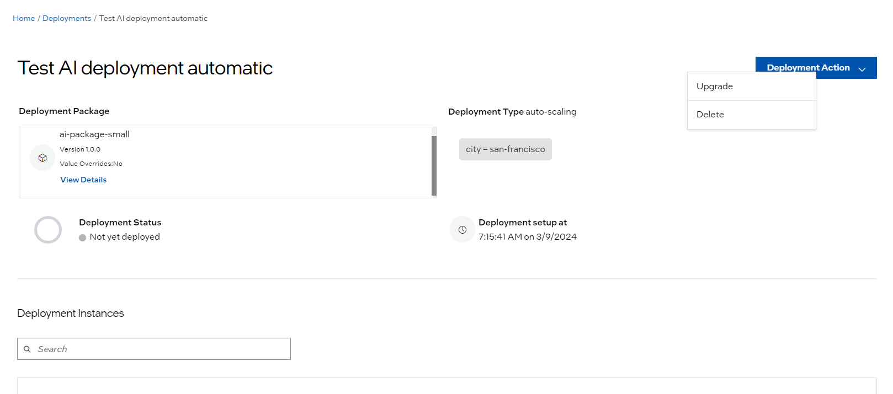
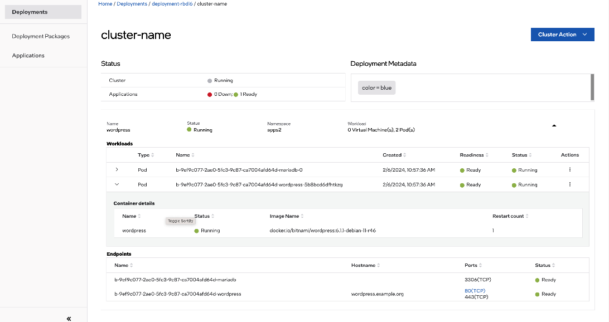
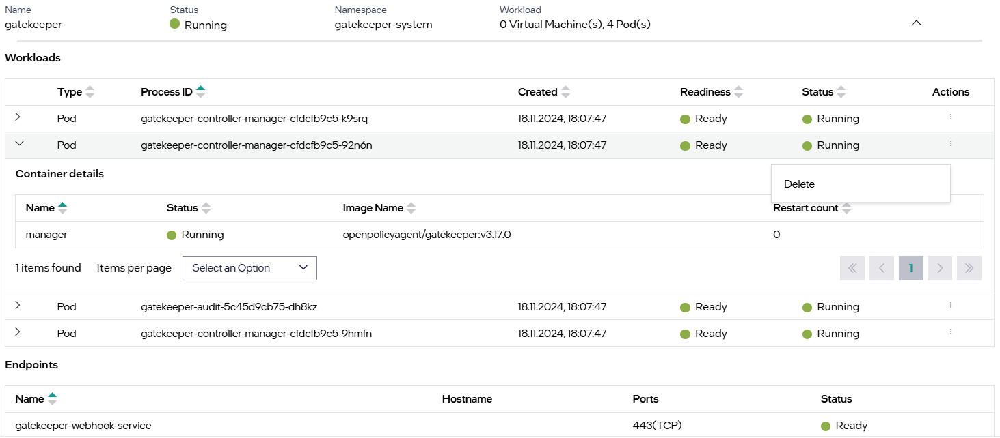
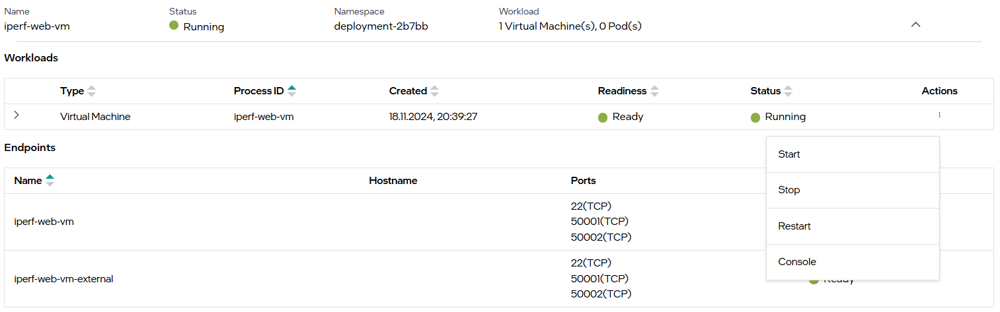

View Deployment Details
==============================

You can view deployment details including the deployment package name and version, whether deployment overrides are configured, the type of deployment (automatic or manual), the deployment status, and the deployment instance status.

Under **Deployment Instance**, use the search box to search for any Cluster ID, Cluster Name, or Status, or click the small up or down arrows next to the column names to sort the instances. For any deployment instance, you can view the following details:

.. list-table::
   :widths: 40 50
   :header-rows: 1

   * - Fields
     - Description

   * - **Cluster ID**
     - Displays the cluster ID. This is a system-generated ID. Click the Cluster ID to view
       the deployment instance details, such as the running status of each application and
       the application resources being created.

   * - **Cluster Name**
     - Displays the user given name of the cluster where the deployment is deployed.

   * - **Status**
     - Displays the status of any given deployment instance with the status indicator, which
       presents an aggregated status for the instance. The available statuses include:

		   * Running: Indicates that the deployment is running.
		   * Removing: Indicates that the deployment is being removed.
		   * Not Provisioned: Indicates that the deployment is not provisioned.
		   * Not Ready: Indicates that the deployment is updated to a newer version.
		   * Error: Indicates that the deployment has encountered an error.

   * - **Applications**
     - Shows the number of applications in running status and the total number of applications
       in the deployment package. For example, the value 1/6 represents that of the total 6
       applications in the deployment package, one application is in running status.

   * - **Action**
     - Provides the option to view `deployment instance details <view-deployment-instance-details>` and
       :doc:`/user_guide/set_up_edge_infra/cluster_details`. Click the three dots
       icon (...) to perform the actions.

.. _deployment_instance:

View Deployment Instance Details
-----------------------------------------
The **Deployment Instance** page allows you to interact with the application resources that are deployed on a specific cluster. It provides the following information:

* Deployment metadata.
* Running status of each application.
* Workloads and endpoints for each application.

.. _workload:

Application Workloads
~~~~~~~~~~~~~~~~~~~~~~~~~~~~~~~~~~~~~~~~~~~~

A Workload is an application running on a cluster inside a set of containers. It can refer to either Virtual Machine or Pod where the application is **Running**. You can perform the following operations on the workloads:

	* For pod-type workloads, you can delete each pod or restart the pod.
	* For virtual machine-type workloads, you can start, stop, restart the VM, and also access the VM console. For more information see the :doc:`vm_actions` section.

**Pod type workloads**

The following figure shows us a deployed pod-type workload. This view shows detailed workload information including a name, created time, and status.

.. list-table::
   :widths: 40 50
   :header-rows: 1

   * - Fields
     - Description

   * - **Type**
     - Displays the type of workload. In this case 'Pod.'

   * - **Process ID**
     - Displays the Process ID (PID) of the pod, which is a unique identifier assigned to each running process in Kubernetes.

   * - **Created**
     - Displays the date when the pod is created.

   * - **Readiness**
     - Indicates the readiness of the pod.

   * - **Status**
     - Indicates the status of the pod. The available statuses are as follows:
		    * Running
		    * Pending
		    * Succeeded
		    * Failed
		    * Unknown

   * - **Action**
     - Allows you to delete the pod.

**VM type workloads**

The following figure shows a deployed VM-type workload, which provides detailed workload information such as a name, created time, and status.

.. list-table::
   :widths: 40 50
   :header-rows: 1

   * - Fields
     - Description

   * - **Type**
     - Displays the type of workload. In this case 'Virtual Machine.'

   * - **Process ID**
     - Displays the Process ID (PID) of the virtual machine, which is a unique identifier assigned to each running process in Kubernetes.

   * - **Created**
     - Displays the date when the virtual machine is created.

   * - **Readiness**
     - Indicates the readiness of the virtual machine.

   * - **Status**
     - Indicates the status of the virtual machine. The available statuses are as follows:
		    * Running
		    * Waiting
		    * Terminated

   * - **Actions**
     - Allows you to start, stop, restart, and connect to the Console. For more information see the :doc:`vm_actions` section.

.. _endpoint_view:

Application Endpoints
~~~~~~~~~~~~~~~~~~~~~~~~~~~~~~~~~~~~~~~~~~~~

The Endpoint view shows all the services associated with the application.

.. figure:: images/endpoint-view-1.png
   :alt: Endpoint View

.. list-table::
   :widths: 40 50
   :header-rows: 1

   * - Fields
     - Description

   * - **Name**
     - Displays the name of the service.

   * - **Hostname**
     - Displays the external domain name for the service. For more information, see EdgeDNS
       in the :doc:`/user_guide/package_software/extensions/load_balancer` section.

   * - **Ports**
     - Displays a list of service ports exposed. The port is hyperlinked if it is accessible
       through the orchestrator. For more information, see Service Link Support in
       :doc:`/user_guide/package_software/package_create_helm` section.

   * - **Status**
     - Indicates the state of the service.
