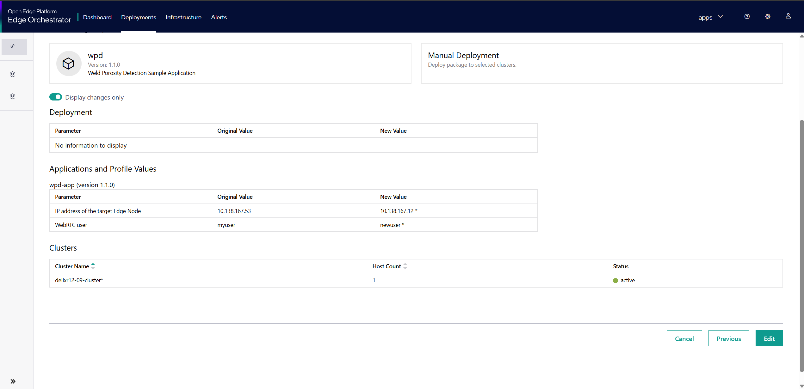

Edit Deployment
===========================

You can edit existing deployments on the Deployments page using the **Edit** feature.

To edit a deployment, perform the following steps:

1. In the **Deployments** page, locate the deployment you want to edit.
2. In the **Action** column, click the three-dots menu, and then click **Edit**.
   The Edit Deployment window appears.

.. figure:: images/edit_deploy1.png
   :scale: 50 %
   :alt: Edit Deployment Button

3. In the **Edit Deployment** window, review the currently selected **Package Profile**.
   If you wish to change the profile, select a different option from the list of available profiles.
   This enables you to update the deployment with a new set of package configurations as needed.
   Once you have confirmed or changed the profile, click **Next** to continue.

4. Review and update any **Override Values** configured for the deployment.
   These values allow you to customize specific parameters or settings for the deployed package.
   Make any necessary adjustments to tailor the deployment to your requirements, then click **Next** to continue.

5. On the **Change Deployment Details** page, you can update the deployment name and cluster selection, depending
   on the deployment type chosen during the deployment setup.

   - If **Automatic** was selected as the deployment type, you can specify metadata in key-value format to determine the target cluster.
   - If **Manual** was selected, you can select one or more clusters from the list of available clusters.

6. Click **Next** to view the **Review** page.

7. The **Review** page provides a summary of all changes made to the deployment, including the selected package profile, override values, and deployment details.
   To focus on modifications, you can enable the **Display changes only** toggle, which highlights only the values that have been updated.

8. Click **Edit** to apply the changes to the deployment.

    .. note::
        Changing the package profile or override values may impact the behavior of the deployed applications. Carefully review all changes before saving.
