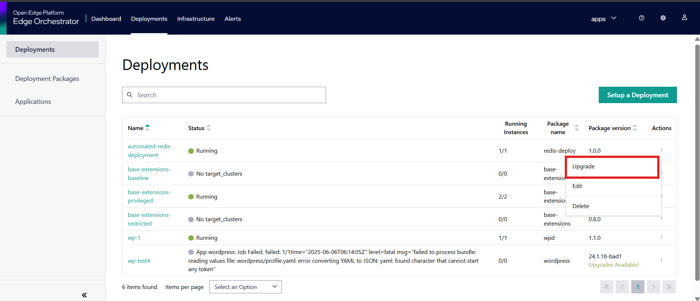
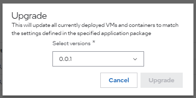

Upgrade Deployment
===========================

You can upgrade existing deployments on the Deployments page using the **Upgrade** feature.

.. note::
    For the Upgrade option to be available, the deployment package names must be identical and the package version must be higher.

To upgrade the deployment, do the following:

1. In the **Deployments** page, select the deployment setup where an upgrade is available.

2. In the **Action** column, click the three-dots menu, and then click **Upgrade**.
3. In the **Upgrade** page, select the version you want to upgrade to. The **Upgrade** window gives the list of Deployment Package versions for the selected Deployment.
4. Click **Upgrade**. The Status will turn into **Updating** and then **Running**.

.. note::
   If you upgrade a deployment with value overrides, the current override values will be upgraded along with the deployment. For example, if there are value overrides for any application in the deployment package, they will remain the same. However, if you want to either create new override values or select a different deployment profile, you must set up a new
   :doc:`deployment </user_guide/package_software/setup_deploy>`.

.. note::
    For applications with dependencies, the dependents' version, name, and profile must match.
