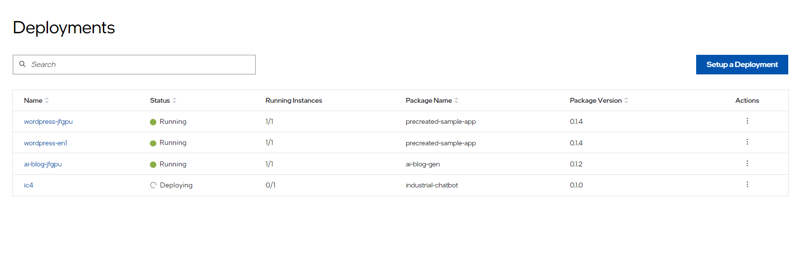

Deployments
===============================================
**Deployment** is a fundamental unit used for orchestrating the deployment of a :doc:`/user_guide/package_software/deploy_packages` in the Catalog.
A deployment contains a deployment package name, profile name, deployment type, and target clusters.

Deployment to clusters and their hosts is initiated when one or more clusters meet the deployment's target cluster criteria.

A **Deployment Instance** refers to an instance of a deployment that has been deployed to a cluster.
It represents the state of that deployment on a specific cluster, essentially the status of applications within the deployed deployment package.

Click the **Deployments** tab on the top menu to view the **Deployments** page. In the **Deployments** page, you can view the list of the deployments that have been created.
The status indicator shows a quick view of the status of the deployment that depends on many factors.

Using the search bar at the top of the page, you can search for a deployment.
The other actions that you can perform from this page are setting up a deployment, deleting a deployment, and upgrading a deployment.

.. list-table::
   :widths: 20, 20
   :header-rows: 1

   * - Field
     - Description

   * - Name
     - The name of the deployment setup.

   * - Status
     - The status of the deployment, such as Running, Deploying, and Down.

   * - Running Instance
     - The number of deployment instances in a Running status and the total number of deployment instances.

   * - Package Name
     - The name of the deployment package.

   * - Package Version
     - The version of the Deployment Package. If a version upgrade is available, it will be shown in this column.

   * - Actions
     - Click the three-dots icon to upgrade or delete the deployment set up.

From this page, you can do the following:

    * :doc:`/user_guide/package_software/setup_deploy`
    * :doc:`/user_guide/package_software/deployment_details`
    * :doc:`/user_guide/package_software/deployment_upgrade`
    * :doc:`/user_guide/package_software/deployment_delete`
    * :doc:`/user_guide/package_software/vm_actions`
    * :doc:`/user_guide/package_software/access_deploy`

.. toctree::
   :hidden:

   setup_deploy
   deployment_details
   deployment_upgrade
   deployment_edit
   deployment_delete
   vm_actions
   access_deploy

**Command Line Management**

For programmatic access and automation, you can use the orch-cli tool to manage deployments.
For detailed command-line operations, see :doc:`/user_guide/package_software/orch_cli/orch_cli_guide`.