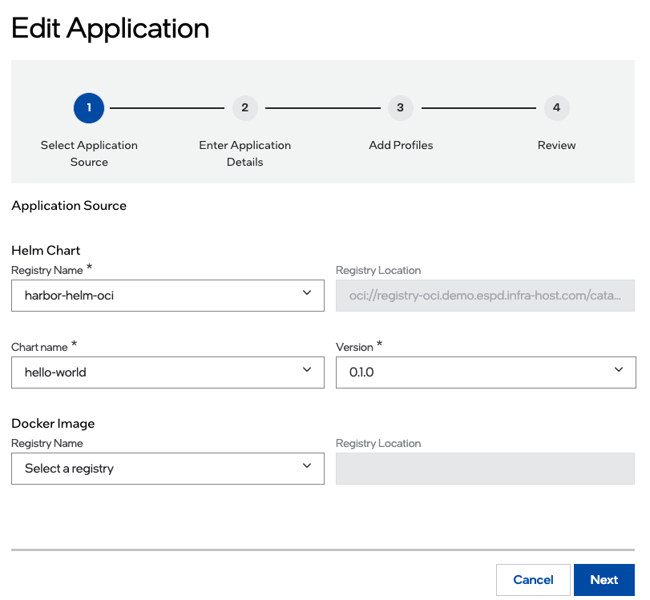
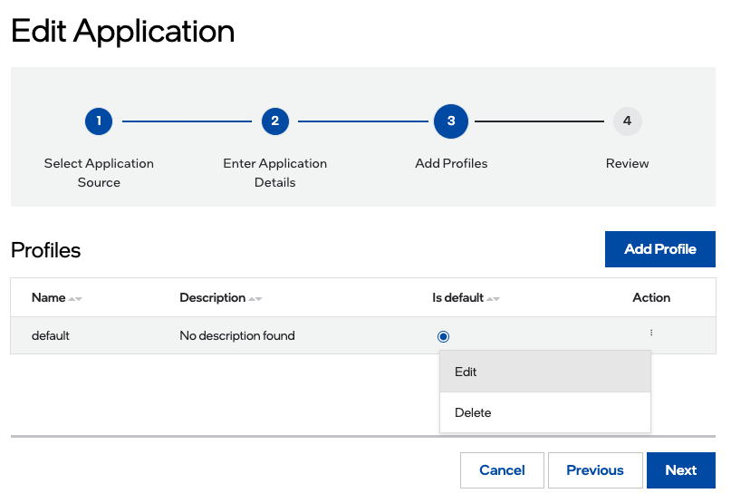

Edit Application
===================
You can edit an existing application after it is added to the **Applications** page.

To edit an application:

#. In the **Applications** page, select the application that you want to edit.

#. In the **Action** column, click the three-dot menu, and then click **Edit**. The **Edit Application** page appears.

3. Edit the chart and image related fields on this page and click **Next**.

	.. note:: You cannot edit the registry location fields.

#. Edit the application details fields on this page and click **Next**.

	.. note:: You cannot edit the name and version of the application.

#. In the **Profiles** page, set a default profile to the selected application or remove a profile that is set as default.

To set a profile as default, check the **Is default** option.

To remove a profile as default, uncheck the **Is default** option.

**Add a profile**

To add a profile:

a. Click **Add Profile**.

#. Update the mandatory fields and click **Add Profile**.

**Edit a profile**

To edit a profile:

a. Identify the profile that you want to edit.

#. In the **Action** column, click the three-dot icon, and then click **Edit**.

#. Update the Description and/or Chart values and click **Update Profile**.

**Delete a profile**

To delete a profile:

a. Identify the profile that you want to delete.

#. In the **Action** column, click the three-dot icon and then click **Delete**.

#. On the confirmation window, click **Delete**.

Click **Next** to review the updates.

Review the updated information and click **Update Application** to confirm the changes.

After the updates are processed, you will be redirected to the **Applications** page.
