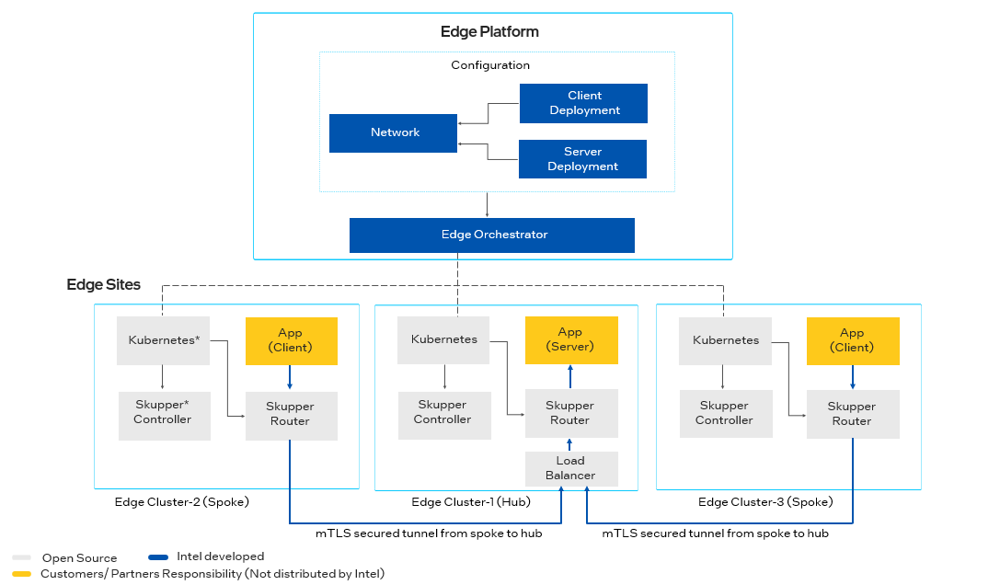

Interconnect
===============================================

**Interconnect**  is a mechanism for connecting applications deployed
at multiple edge sites (clusters).

Interconnect makes use of a local router deployed to the edge alongside
the applications to give a Hub and Spoke pattern of links.
A client application may connect to the router at the client edge site (the Spoke),
which in turn connects to a corresponding router at the server edge site
(the Hub), which then connects to the server application.

The routers at the edge sites are responsible for routing the traffic between
the client and server applications.

For these instructions, let us assume assume that you have a simple
client/server application. You want to deploy the server on one edge cluster, and the client to another
edge cluster.
Links will be established from the client(s) to the server (Spokes to the Hub).

The Interconnect makes use of an opensource component called
Skupper interconnect, described at https://skupper.io.
|software_prod_name| automates the configuration of Skupper interconnect on the
Edge clusters.

Perform the following steps to use the Interconnect feature:

1. Annotate your server application's **service** with the
   following annotations to expose services to the router.

   .. list-table::
      :header-rows: 1
      :widths: 50 50

      * - Annotation
        - Description

      * - **network.app.edge-orchestrator.intel.com/expose-service**
        - Set to "true" to expose the service to the router.

      * - **network.app.edge-orchestrator.intel.com/expose-port**
        - The port number to expose.

   .. note:: The service must be of type `ClusterIP` to be exposed to the router.

   Following is an example:

   .. code:: yaml

     apiVersion: v1
     Kind: Service
     metadata:
       name: my-backend
       annotations:
         network.app.edge-orchestrator.intel.com/expose-service: "true"
         network.app.edge-orchestrator.intel.com/expose-port: "8080"
    spec:
        ports:
        - port: 8080
            targetPort: 8080
        selector:
            app: my-backend
        type: ClusterIP

   Without the annotations, the service will not be exposed to the interconnect.
   The Skupper router will automatically route client requests to this server.

   .. note:: The router will create another `service` of type `Loadbalancer`
      in the `interconnect` namespace. An IP address will be assigned to this service.
      Installing the `load-balancer` extension (see below) facilitates this.

2. Configure your client to connect to the Skupper router.

   Your client application must be configured to connect to the backend as a service
   on your client's local cluster. How you configure this depends on your client application, and
   on the service name you used in your service.

   The DNS name of the service is the

   **http|https://<service name>.<namespace>.svc.cluster.local:<port>**

   The port is the same as the port number you exposed on the server side.

   For example:

   .. code:: yaml

      backend:
        address:
          "http://my-backend.interconnect.svc.cluster.local:8080"

3. Create a network object. The Graphical User Interface does not support this and must be done using a REST API call.

   .. note::
       You must be a member of the `Edge-Manager-Group` or `Edge-Operator-Group` for your project as described in
       :doc:`/shared/shared_iam_groups` to perform these steps.

   Create a JWT using the instructions Obtaining a JSON Web Token (JWT) in :doc:`/shared/shared_gs_iam`, which will
   fill the ``JWT_TOKEN`` variable. Then fill in the variables in the example below and run these commands:

   .. code:: bash

      export CLUSTER_FQDN=<your-orchestrator-domain-name>
      export PROJECT_NAME=<your-project-name>
      export NETWORK_NAME=<choose-a-name-for-your-new-interconnect>

      cat << EOF > network.json
      {"description": "Network for Interconnect", "type": "application-mesh"}
      EOF
      curl https://api.${CLUSTER_FQDN}/v1/projects/${PROJECT_NAME}/networks/${NETWORK_NAME} \
      -X PUT -H "authorization: Bearer ${JWT_TOKEN}" \
      -H "Content-Type: application/json" \
      -d @network.json

   If you would like to verify the network was created, you can do the
   following and ensure it is in the returned list:

   .. code:: bash

      curl https://api.${CLUSTER_FQDN}/v1/projects/${PROJECT_NAME}/networks \
      -H "authorization: Bearer ${JWT_TOKEN}"

4. Deploy a load balancer on the clusters that will host the server.

   The clusters that host your server must be routable from the clusters
   where you run your clients, and so a LoadBalancer is required.
   We recommend using the Load-Balancer extension (which uses metallb*
   opensource project) package to deploy a load-balancer, which can be
   used by the router.
   The Load-Balancer is documented in
   :doc:`/user_guide/package_software/extensions/load_balancer`.

   .. note:: The Load-Balancer is only needed on the server (Hub) Edge cluster.

   .. note:: During deployment of the Load-Balancer, you should **not** select
      the Network created in step 3 (if prompted).

5. Deploy the Skupper extension on all clusters that will participate in the Interconnect.

   This package is available as an extension package (see
   :doc:`/user_guide/package_software/extension_package` )
   in the application catalog. Create a Deployment (see
   :doc:`/user_guide/package_software/deployments`)
   that deploys this extension package to all edges that will use the Interconnect.

   .. note:: During deployment of Skupper extension, you must **not** select
      the Network created in step 3 (if prompted).

6. Deploying the server application to use the Interconnect

   Follow the typical workflow at :doc:`/user_guide/package_software/deployments`
   to deploy your server application.

   If any networks present (such as the one created above),
   then an additional page is displayed during the deployment workflow.
   This page allows you to select the network that your deployment will participate in.

   .. figure:: images/interconnect-select-network.png
      :width: 913px
      :height: 690px
      :scale: 75 %
      :alt: Selecting Network during deployment of the server application.

  On this page, select the network that your deployment will participate in.
   For example, use the network you created in step 3.

   You must also expose the server applications that contain the
   service(s) that have been annotated in Step 1. Click the checkbox
   to expose the application(s).

   .. note:: If the application is not exposed in this step, the router will not
      route traffic to the annotated service.

7. Deploy the client application to use the Interconnect.

   The procedure is identical to step (6), selecting the Network, but
   not choose any applications to expose.

Best Practices
===============================================

It is essential that when deploying the load balancer for your server,
that you do not expose this directly to the Internet.
The consequence of exposing the load-balancer to the internet is that it
could be attacked by malicious actors.
How to achieve this network isolation depends on the specific infrastructure
you are using. For example, VPNs and Firewalls may be useful.

Using TLS between your applications and the routers is a recommended
practice. This is described in https://skupper.io/docs/cli/native-security-options.html.
Certificates are placed in the following secrets:

* `skupper-tls-<deploymentname>` - contains `tls.crt`, `tls.key`, and `ca.crt`. To be used by your server to accept connections from the Router.

* `skupper-tls-client` - contains `ca.crt`. To be used by your client to connect to the Router.

How your application makes use of these secrets is application dependent.

Troubleshooting Interconnect
===============================================

If you are having trouble with the Interconnect, the following steps may help:

On the |software_prod_name|
~~~~~~~~~~~~~~~~~~~~~~~~~~~~

To see a list of the Network(s) driving the Interconnect Hub and Spoke pattern:

   .. code:: bash

      kubectl get network -o yaml

To see a list of the clusters participating in the Interconnect Hub and Spoke pattern:

   .. code:: bash

      kubectl get clusters.interconnect.app.edge-orchestrator.intel.com

To see a list of the links participating in the Interconnect Hub and Spoke pattern, use the following:

   .. code:: bash

      kubectl get links.interconnect.app.edge-orchestrator.intel.com

To see a list of the services exposed on the Interconnect, use the following:

    .. code:: bash

        kubectl get services.interconnect.app.edge-orchestrator.intel.com

Pods on the Hub or Spoke Edge Node Cluster
~~~~~~~~~~~~~~~~~~~~~~~~~~~~~~~~~~~~~~~~~~~~~~~~~~~

To see a list of the pods in the `interconnect` namespace (where the router is running):

   .. code:: bash

      kubectl -n interconnect get all

There should be two pods `skupper-service-controller` and `skupper-router`.

- The `skupper-router` pod will only be present if you have deployed an
  application that uses the Interconnect.

- The `skupper-service-controller` pod will always be present whenever the `skupper`
  extension is deployed, regardless of whether or not any applications use the
  Interconnect.

There should be a service for each annotated service(s) in your server application.

On the server (Hub) side, the Service will be of type `LoadBalancer` and
will have an IP address assigned.

.. note:: They are maintained by `skupper-site-controller`  in the `skupper-site-controller`
   namespace. The are no CRDs associated with Skupper interconnect on the Edge cluster.

