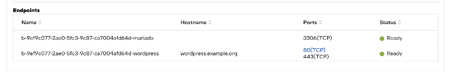

Package an Application for the Registry
======================================================

This section describes how to package the application as a container image and create a Helm\* chart.

After these steps, go to the :doc:`/user_guide/package_software/push_registry` section
to add the Helm chart to the registry.

Package the Application as a Container Image
-----------------------------------------------

To create a Docker\* container image for an application, write a Dockerfile and then build it as follows:

1. Install the Docker software from `Install Docker Engine <https://docs.docker.com/engine/install/>`_.

#. Write a Dockerfile by referring to `Dockerfile reference <https://docs.docker.com/engine/reference/builder/>`_. The following snippet is an example of Dockerfile:

   .. code:: dockerfile

      # Dockerfile
      FROM ubuntu:22.04

      RUN apt update
      RUN apt install -y python3

      COPY ./source_app /app
      RUN make /app

      CMD python /app/app.py

      # FROM: To describe a base image; Ubuntu 22.04 is the base image in this example.
      # RUN: To execute build commands; Installing Python3 library and then building applications with Makefile in this example.
      # COPY: To copy files or directories to this image; source_app directory is copied to the image /app directory in this example.
      # CMD: To specify default commands; app.py will be executed by default when spinning up this image in this example.

#. Build the container image, with the following Docker commands:

   .. code:: bash

      $ cd /path/to/Dockerfile/directory
      $ docker build -t <image_name> .

      # example:
      $ docker build -t registry.orchestrator.intel.com/apps/app:0.0.1

#. Verify that the image is created and stored in the local Docker registry, with the following commands:

   .. code:: bash

      $ docker images

.. note::
   For a more comprehensive guide to packaging applications, see the Application Developer Workflow guide
   :doc:`/developer_guide/application_developer_workflow/packaging-applications/index`

Create a Helm Chart for an Application
-----------------------------------------

To deploy applications in container images, you need to write a Helm chart.
Helm chart is a well-known package format for cloud application to deploy containers to target Kubernetes\* clusters.
A Helm chart contains the `Chart.yaml` file that describes basic chart information, `values.yaml` file that includes configurable
parameters, and `templates` directory that includes Kubernetes resource and application definition files.
You can refer to the `Getting Started <https://helm.sh/docs/chart_template_guide/getting_started/>`_
section of the official Helm chart documentation.

.. note::
   For a comprehensive guide to writing Helm charts, see the Application Developer Workflow guide
   :doc:`/developer_guide/application_developer_workflow/deployment-helm/index`
   which includes a section on Helm Chart best practices.

Create a Helm Chart for a Basic Application
~~~~~~~~~~~~~~~~~~~~~~~~~~~~~~~~~~~~~~~~~~~~~~~
This section briefly introduces a basic Helm chart example for the NGINX\* application.
There are three files in this Helm Chart: `Chart.yaml`, `values.yaml`, and `deployment.yaml` in the `templates` directory for deployment resource.

Chart.yaml file content:

.. code:: yaml

   # chart.yaml
   apiVersion: v2
   name: nginx
   description: NGINX Application Helm chart
   version: 15.12.2

Explanation:

* apiVersion: The API version of the chart
* name: The name of the chart
* version: The version of the chart in SemVer2 format
* description: A description of this chart

values.yaml file content:

.. code:: yaml

   # values.yaml
   image:
      tag: bitnami/nginx:1.25.4-devian-12-r2
      pullPolicy: IfNotPresent
      pullSecrets: []
   replicas: 1

templates/deployment.yaml file content:

.. code:: yaml

   # deployment.yaml
   apiVersion: apps/v1
   kind: Deployment
   metadata:
      name: nginx
      labels:
      app: nginx
   spec:
      replicas: {{ .Values.replicas }}
      selector:
      matchLabels:
         app: nginx
      template:
      metadata:
         labels:
            app: nginx
      spec:
         {{- with .Values.image.pullSecrets }}
         imagePullSecrets:
            {{- toYaml . | nindent 8 }}
         {{- end }}
         containers:
            - name: nginx
            image: {{ .Values.image.tag }}
            imagePullPolicy: {{ .Values.image.pullPolicy }}
            ports:
               - name: http
                  containerPort: 8080

Explanation:

* apiVersion: The version of Kubernetes API that you are using.
* kind: The kind of object you are creating.
* metadata: The data that helps uniquely identify the object.
* spec: The object specification.

.. note::
   If you want to get config values from the values.yaml file, use `{{ .Values.<path> }}` such as {{ .Values.image.tag }} for the image tag.

.. note::
   For detailed information on writing a Helm chart, refer to the official
   `Helm chart documentation <https://helm.sh/docs/chart_template_guide/getting_started/>`_.

Create a Helm Chart for an Advanced Application
~~~~~~~~~~~~~~~~~~~~~~~~~~~~~~~~~~~~~~~~~~~~~~~~

To use |software_prod_name| advanced features such as service link and multiple network interfaces, you must add more configurations to the Helm chart.
This section shows how to create a Helm chart to use the advanced features.

.. note::
   For a more advanced application development other than following sub-sections, refer to the
   :doc:`/user_guide/package_software/extension_package` section.

.. _service_link_support:

Service Link Support (Application Service Proxy)
^^^^^^^^^^^^^^^^^^^^^^^^^^^^^^^^^^^^^^^^^^^^^^^^^^^

If you want to access an application through a link in the |software_prod_name| user interface, you can expose a port
by adding the annotation `service-proxy.app.orchestrator.io/ports: <port-number>` into service resource files in the
templates directory. If the port is running an https service, prefix the port number with `https:`. Both the HTTP and
HTTPS ports can be given, e.g. **80,https:443**.

The |software_prod_name| then provides a hyperlink in a UI endpoint view to access the application through the port in
the Kubernetes service.

.. note::
   While this facility is a great convenience for quickly accessing remote applications, it does involve some network
   hops that may affect the responsiveness of the application. For production applications, Intel recommends to use a
   more direct access method, which is the load balancer service on the edge node.

The following is an example of Service resource in the templates directory.

.. code:: yaml

   apiVersion: v1
   kind: Service
   metadata:
      ...
      annotations:
      # By default, the orchestrator proxies to your service using HTTP:
      #   service-proxy.app.orchestrator.io/ports: <http-port-number>
      # To use HTTPS, prefix the port number with https:<https-port-number>.
      #   service-proxy.app.orchestrator.io/ports: https:<https-port-number>
      # Multiple port numbers can be specified with a comma delimited list.
      #   service-proxy.app.orchestrator.io/ports: <http-port-number>,https:<https-port-number>. Port numbers to expose through orchestrator.
      service-proxy.app.orchestrator.io/ports: 80,https:443
      ...

.. note::
   The service link works through the Kubernetes API Proxying feature. It only works for HTTP and HTTPS protocols. Additionally,
   the `Authorization` header is dropped from calls through the service link (this can be mitigated by copying
   the `X-App-Authorization` header to the `Authorization` header in the end application on each request, possibly through
   the addition of a sidecar with Envoy\*, NGINX\*, Kong\*, or any other proxy technology).

The Service Link feature will appear as a hyperlink in the port column of the endpoint view:

Clicking the link will open a new tab in the browser, briefly redirecting to check authentication and redirecting to the
edge web application.

.. note::
   A web application accessed like this through Service Link can only handle one application at a time. To open a second
   application, you need to open the link in a different browser (e.g. Firefox\*) or in the browser's incognito mode.

Add Multiple Network Interfaces
^^^^^^^^^^^^^^^^^^^^^^^^^^^^^^^^^^

You can add more network interfaces to a pod using **multus** and **Container Network Interfaces (CNIs)**, such as `macvlan`
for container-based applications and `macvtap` for virtual-machine-based applications.

Macvlan Network Configuration for Container-based Application
^^^^^^^^^^^^^^^^^^^^^^^^^^^^^^^^^^^^^^^^^^^^^^^^^^^^^^^^^^^^^^^^^^^

`macvlan` is a virtual LAN (Layer 2) that assigns multiple IP addresses to the same physical network interface (`<https://documentation.ubuntu.com/lxd/en/stable-5.0/reference/network_macvlan/>`_).

.. note::
   This network configuration is only for a container application, not for a virtual-machine-based application.

To add a macvlan network interface in a container application, you need to add the target host machines' network configuration
into the 1) Helm chart's `NetworkAttachmentDefinition.yaml` file and 2) Pod, Deployment, and StatefulSet container application
resource files:

1. Add the network configuration that comprises the target host machine's network interface name and subnet information
in the JSON format, to the `config` field in the `NetworkAttachmentDefinition.yaml` file. The following is an example of
the networkattachementdefinition.yaml file:

   .. code:: yaml

      apiVersion: "k8s.cni.cncf.io/v1"
      kind: NetworkAttachmentDefinition
      metadata:
      name: macvlan-conf
      spec:
      config: '{
         "cniVersion": "0.3.1",
         "plugins": [
         {
            "type": "macvlan",
            "capabilities": { "ips": true },
            "master": "<interface_name>", # network interface name, e.g., eth0
            "mode": "bridge", # bridge mode
            "ipam": {
            "type": "static", # to assign static IP address; we can use dhcp here
            "routes": [
               {
               "dst": "0.0.0.0/0", # we can add static routing rules
               "gw": "10.1.1.1"
               }
            ]
            }
         }, {
            "capabilities": { "mac": true },
            "type": "tuning"
         }
         ]
      }'

#. When the `NetworkAttachmentDefinition` is ready, add the network configuration to annotations in the container
   application-related resource files. The resource files comprises the Pod, Deployment, and Statefulset files. The
   following is an example of the Pod file:

   .. code:: yaml

      # example in Pod type resource
      apiVersion: v1
      kind: Pod
      metadata:
      name: macvlan-app
      annotations:
         k8s.v1.cni.cncf.io/networks: '[
            { "name": "macvlan-conf", # should be matched to NetworkAttachmentDefinition name
               "ips": [ "10.1.1.101/24" ], # set static IP address we want
               "mac": "c2:b0:57:49:47:f1", # set MAC address we want
               "gateway": [ "10.1.1.1" ] # set gateway IP address
            }]'
         ...

   .. note::
      For more information on macvlan network configuration, refer to `macvlan plugin <https://www.cni.dev/plugins/current/main/macvlan/>`_.

Macvtap Network Configuration for Virtual Machine-based Application
^^^^^^^^^^^^^^^^^^^^^^^^^^^^^^^^^^^^^^^^^^^^^^^^^^^^^^^^^^^^^^^^^^^^

`macvtap` is a Linux\* kernel device driver that facilitates virtualized bridge networking
(`<https://virt.kernelnewbies.org/MacVTap>`_) .

.. note::
   This network configuration is only for a virtual machine-based application, not for a container-based application.

To add the macvtap network interface, you need to add a new interface configuration in the Helm chart's virtual machine
resource file (``virtualmachine.yaml`` file) that resides in the templates directory:

1. Add the **network configuration** for macvtap interfaces along with the existing network interface (for example, the
POD network interface), to the `networks` section under the `spec.template.spec` section.

#. Add **macvtap interfaces** to the `interfaces` section under the `spec.template.spec.domain.devices` section. After
adding entries into the two sections, the virtual machine-based application will have macvtap network interfaces as follows:

   .. code:: yaml

      # virtualmachine.yaml file in templates directory
      apiVersion: kubevirt.io/v1
      kind: VirtualMachine
      ...
      spec:
      ...
      template:
         ...
         spec:
         ...
         domain:
            ...
            devices:
            ...
            logSerialConsole: false # must be false for macvtap
            interfaces:
               - name: default
               pod: {}
               - name: macvtap # for macvtap interface
               binding:
                  name: macvtap # for macvtap interface
               macAddress: 00:03:ff:00:00:01 # optional if we want to set MAC address to this interface
               pciAddress: 0000:02:00.0 # optional if we want to set pci address to this interface
               ...
         networks:
            ...
            - name: default
            pod: {}
            - name: macvtap # for macvtap interface
            multus: # for macvtap interface
               networkName: macvtap # for macvtap interface
               ...

   .. note::
      For the macvtap CNI feature to be functional, set `logSerialConsole` to `false`.
      Otherwise, the Deployment status will always be in the `Deploying` state.

   .. note::
      You can automatically assign the IP address with `cloud-init` (`<https://kubevirt.io/user-guide/virtual_machines/startup_scripts/#cloud-init>`_ and `<https://cloudinit.readthedocs.io/en/latest/>`_). The following code snippet is an example of cloud-init in virtual machine resource file.

   .. code:: yaml

      # virtualmachine.yaml file in templates directory
         apiVersion: kubevirt.io/v1
         kind: VirtualMachine
         ...
         spec:
         ...
         template:
            ...
            spec:
            ...
            domain:
               ...
               devices:
               ...
               disks:
                  - name: containerdisk # for the containerized VM image
                  disk:
                     bus: virtio
                  - name: cloudinitdisk # for the cloud-init script
                  disk:
                     bus: virtio
               logSerialConsole: false # must be false for macvtap
               interfaces:
                  - name: default
                  pod: {}
                  - name: macvtap # for macvtap interface
                  binding:
                     name: macvtap # for macvtap interface
                  macAddress: 00:03:ff:00:00:01 # optional if we want to set MAC address to this interface
                  pciAddress: 0000:02:00.0 # optional if we want to set pci address to this interface
                  ...
            networks:
               ...
               - name: default
               pod: {}
               - name: macvtap # for macvtap interface
               multus: # for macvtap interface
                  networkName: macvtap # for macvtap interface
                  ...
            volumes:
               - name: containerdisk
               ...
               - name: cloudinitdisk # for cloudinit disk
               cloudInitNoCloud:
                  userData: |- # for cloud-init user data
                  #cloud-config
                  users:
                     - name: ubuntu
                     shell: /bin/bash
                     sudo: ['ALL=(ALL) NOPASSWD:ALL']
                  ssh_pwauth: True
                  chpasswd:
                     list: |
                     ubuntu:ubuntu
                     expire: False
                  write_files:
                     - path: /bin/startup.sh
                     permissions: 0755
                     owner: root:root
                     content: |
                        #!/bin/bash
                        sudo systemctl restart qemu-guest-agent
                  runcmd:
                     - /bin/startup.sh
                  networkData: |- # for cloud-init network data
                  network:
                     version: 2
                     ethernets:
                     enp1s0: # this is for POD network
                        dhcp4: true
                        dhcp4-overrides:
                        route-metric: 100
                     enp2s0: # this is for macvtap network
                        match:
                        macaddress: "00:03:ff:00:00:01" # should be matched to MAC address in macvtap interface definition
                        addresses:
                        - 10.1.0.31/24 # target IP address
                        routes:
                        - to: 0.0.0.0/0 # add new routing rules
                           via: 10.1.0.1
                           metric: 0

   .. note::
     `cloud-init` only works for Linux-based OS.
      For Windows OS, use `SysPrep` (`link <https://kubevirt.io/user-guide/virtual_machines/startup_scripts/#sysprep>`_).

#. Add `NetworkAttachmentDefinition` to the Helm chart's ``network.yaml`` file that resides in the templates directory:

   .. note::
      The NetworkAttachmentDefinition requires the target physical network interface name in the clusters' host machines for a virtual machine-based application. On the host machines, you can check for this information with the `ifconfig` command.

   The following is an example of NetworkAttachmentDefinition:

   .. code:: yaml

      # network.yaml in templates directory
      apiVersion: "k8s.cni.cncf.io/v1"
      kind: NetworkAttachmentDefinition
      metadata:
      name: macvtap
      annotations:
         k8s.v1.cni.cncf.io/resourceName: macvtap.network.kubevirt.io/enp81s0f0 # enp81s0f0 is the target physical network interface name in host machines
      spec:
      config: '{ "cniVersion": "0.3.1", "name": "release-name-macvtap", "type": "macvtap", "mtu": 1500 }'

   .. note::
      If you do not know the target physical network interface name, contact your system administrator.

Other CNIs
^^^^^^^^^^^^^^

There are various types of network configurations for applications running on the Kubernetes\* system, such as `bridge`, `ipvlan`, `ptp`, and so on. For more information, refer to `<https://www.cni.dev/plugins/current/main/>`_.
