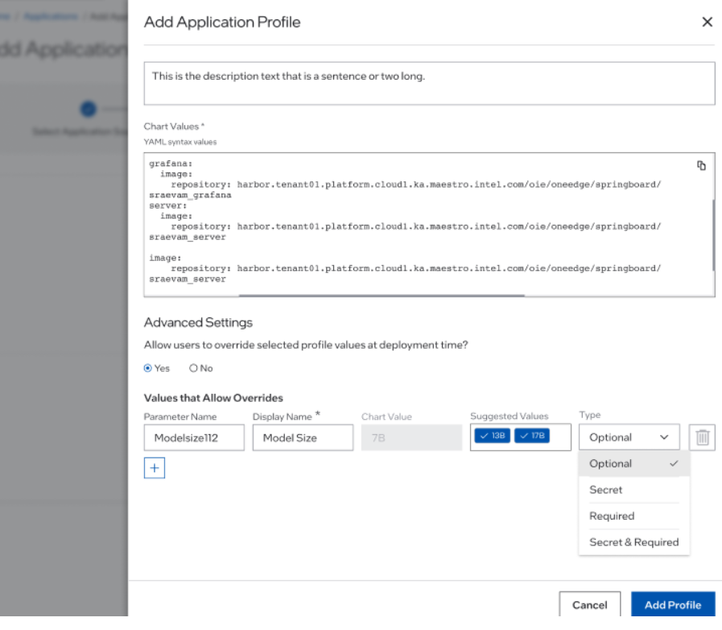

Parameter Templates
===============================================

You can use the parameter template to override Helm\* chart values when deploying an application. These
values are profile-specific and are typically known to the developer. You may need to change some overridden values, or define confidential values as secret, before deployment.

For example, if your application needs a valid IP address to run, you can create a parameter template for the IP address so that unless you provide the IP address, the application will not be deployed.

To add a parameter template:

1. Populate the **Chart values** field when you add an application profile.
#. In Advanced Settings, select **Yes** to allow users to override selected profile values at deployment time.
#. Click on the add button to add a parameter template. **Note:** you can only select a value that is already in the chart values field that you populated in step 1.
#. Once completed, click "Add Profile" to create and add the profile.

.. list-table::
   :widths: 1, 5
   :header-rows: 1

   * - Field
     - Description

   * - Parameter Name
     - **<Required>** The name of the parameter template.

   * - Display Name
     - **<Optional>** The display name of the template, which is displayed on user interfaces.

   * - Chart Value
     - **<View Only>** The default value provided in the chart values.

   * - Suggested Values
     - **<Optional>** A list of suggested values to use, to override the default value.

   * - Type
     - **<Required>** The type of parameter template. Options: Optional, Secret, Required, and Secret & Required.
