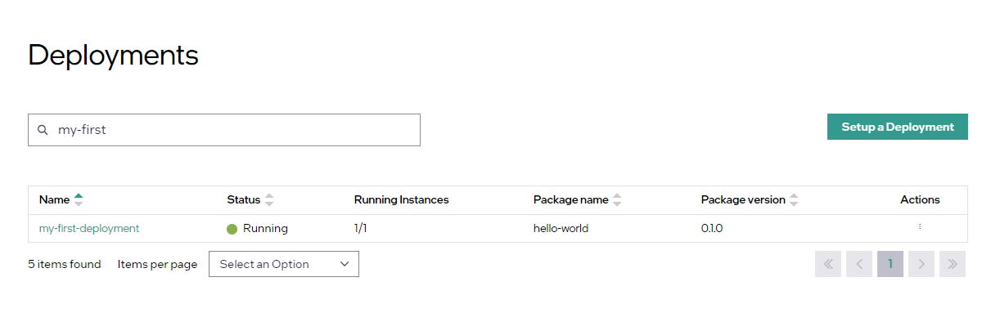

Deployment Example
=========================================

This section shows how to run Docker\* applications on a set of distributed clusters.

Prerequisites: A working |software_prod_name| platform with at least one edge
cluster, and a basic knowledge of Docker, Helm\*, and Kubernetes\* systems.

Overview of the steps:

#. Upload the application's Docker image to the |software_prod_name|'s
   Harbor\* registry.
#. Create a Helm chart to run the image and upload it to the
   |software_prod_name| Harbor registry.
#. Create a deployment package and upload it to the
   |software_prod_name|'s catalog service.
#. Deploy the application onto a cluster.
#. Verify that the application is successfully deployed.

.. note::
   In the following, replace:

   * <CLUSTER_FQDN> with **domain name** of your |software_prod_name| cluster
   * <ORG_NAME> with the name of your organization
   * <PROJECT_NAME> with the name of your project

Prerequisites
--------------------------------

Install the following tools on a machine that has connectivity to the
|software_prod_name| services:

- Docker software: https://www.docker.com/get-started/
- Helm command-line interface: https://helm.sh/docs/intro/install/

Get Harbor Credentials
--------------------------------

To get the |software_prod_name|'s Harbor credentials:

1. Log in to ``https://registry-oci.<CLUSTER_FQDN>`` using your
   |software_prod_name| IAM credentials. You must be in the
   `Edge-Manager-Group` for your project, to access the
   registry.  See :doc:`/shared/shared_iam_groups` for details.

#. Access **User Profile** at top right:

   .. image:: images/quick_start/user-profile.png
      :width: 800px
      :alt: Harbor registry's Projects page.

   .. note:: In this figure, the `catalog-apps-<ORG_NAME>-<PROJECT_NAME>` is the default project where you will upload your Docker images and Helm charts. You can create additional projects if needed.

#. You will see the following:

   .. image:: images/quick_start/cli-secret.png
      :width: 400px
      :alt: User Profile and CLI secret.

#. Copy the **CLI secret**

#. To log in to Docker software and Helm software as follows, use your KeyCloak
   username as the user and the CLI secret as the password.

Upload the Docker Image
----------------------------------

This example uses the
`Official Docker image for NGINX\* web server <https://hub.docker.com/_/nginx>`_.
You can use any Docker image.

To upload the Docker image:

1. Log in to the Harbor registry using the Harbor username and password
   obtained earlier. Replace <CLUSTER_FQDN> with the DNS name of
   your |software_prod_name| cluster:

   .. code:: bash

      export CLUSTER_FQDN=<CLUSTER_FQDN>
      export ORG_NAME=<ORG_NAME>
      export PROJECT_NAME=<PROJECT_NAME>
      docker login registry-oci.${CLUSTER_FQDN}

#. Pull the NGINX image from Docker Hub, tag it for the |software_prod_name|
   registry, and push it:

   .. code:: bash

      docker pull nginx:1.27.0-alpine
      docker tag nginx:1.27.0-alpine registry-oci.${CLUSTER_FQDN}/catalog-apps-${ORG_NAME}-${PROJECT_NAME}/nginx:1.27.0-alpine
      docker push registry-oci.${CLUSTER_FQDN}/catalog-apps-${ORG_NAME}-${PROJECT_NAME}/nginx:1.27.0-alpine

For details on packaging your own applications, see `Package the Application as a Container Image <#package-the-application-as-a-container-image>`__.

Create and Upload the Helm Chart
-----------------------------------------------

The next step is to create a Helm chart for the application:

1. Generate a basic Helm chart:

   .. code:: bash

      helm create hello-world

   This will create a new directory, *hello-world*, with several files in it.

#. In the file *hello-world/values.yaml*, change the image repository (replace <CLUSTER_FQDN>, <ORG_NAME>, and <PROJECT_NAME> with your values):

   .. code:: yaml

      image:
        repository: registry-oci.<CLUSTER_FQDN>/catalog-apps-<ORG_NAME>-<PROJECT_NAME>/nginx

#. In file *hello-world/Chart.yaml*, change the `appVersion`:

   .. code:: yaml

      appVersion: "1.27.0-alpine"

#. In the file *hello-world/templates/service.yaml*, add the following annotations
   block after the labels. Note the indentation:

   .. code:: yaml

      apiVersion: v1
      kind: Service
      metadata:
        name: {{ include "hello-world.fullname" . }}
        labels:
          {{- include "hello-world.labels" . | nindent 4 }}
        annotations:
          service-proxy.app.orchestrator.io/ports: "80"

   .. note:: Generally it is a bad practice to hardcode annotations into a Helm chart, but for this example it is acceptable.

#. Package the new Helm chart:

   .. code:: bash

      helm package hello-world

   This will create the file *hello-world-0.1.0.tgz*.

#. Upload the new Helm chart to the |software_prod_name|'s Harbor registry; login using the same Harbor credentials as before:

   .. code:: bash

      helm registry login registry-oci.${CLUSTER_FQDN}
      helm push hello-world-0.1.0.tgz oci://registry-oci.${CLUSTER_FQDN}/catalog-apps-${ORG_NAME}-${PROJECT_NAME}

For details on packaging your own Helm charts, see `Create a Helm Chart for an Application <create-a-helm-chart-for-an-application>`__.

Create and Upload the Deployment Package
-------------------------------------------------------------

A deployment package wraps one or more Helm charts into a package deployable by |software_prod_name|.

To create a deployment package for the application:

1. In the |software_prod_name| UI, click on **Deployments** at top, then
   **Applications** at left.

#. Click the **Add Application** button.  Under **Helm Chart**, enter:

   * Helm Chart Registry Name: harbor helm oci(harbor-helm-oci)
   * Chart name: hello-world
   * Version: 0.1.0
   * Docker Image Registry Name: harbor docker oci(harbor-docker-oci)

   .. image:: images/quick_start/app-source.png
      :width: 800pt
      :alt: Application source

#. Click *Next*. Under **Application Details**, enter:

   * Application Name: hello-world
   * Version: 0.1.0

   .. image:: images/quick_start/app-details.png
      :width: 800pt
      :alt: Application details

#. Click **Next** and then click **Add Profile**. A profile is where you can specify
   :doc:`parameter templates </user_guide/package_software/param_template>`
   for the Helm chart. Enter:

   * Name: default-profile
   * Description: "Default profile"
   * Chart values:

   .. code:: yaml

      ---
      service:
        type: ClusterIP
      replicaCount: 1
      imagePullSecrets:
        - name: '%GeneratedDockerCredential%'

   .. image:: images/quick_start/app-profile.png
      :width: 800pt
      :alt: Add profile

#. Click **Add Profile** > **Next** > **Add Application**.

   For details on adding applications, see
   :doc:`/user_guide/package_software/add_applications`.

#. Click **Deployment Packages** at left, and then click the **Create
   Deployment Package** button. Under **General Information**, enter:

   * Name: hello-world
   * Version: 0.1.0

   .. image:: images/quick_start/deploy-info.png
      :width: 800pt
      :alt: Create deployment package

#. Click **Next**. On the next screen, select the "hello-world" application:

   .. image:: images/quick_start/select-applications.png
      :width: 800pt
      :alt: Select the "hello-world" application.

#. Click **Next** twice, and then click **Add Deployment Package**.
   You will return to the **Deployment Packages** page and you will
   see "hello-world" in the list.

For details on creating deployment packages, see
:doc:`/user_guide/package_software/add_deploy_pack`.

Deploy the Application
----------------------------------------

To deploy your application to an edge cluster:

1. Click on the three-dot-button to
   the right of the "hello-world" Deployment Package and select **Deploy**:

   .. image:: images/quick_start/select-deploy.png
      :width: 800pt
      :alt: Select deployment package

#. Click **Next** twice, until you get to **Select a Deployment Type**.
   Choose **Manual** and click **Next**:

   .. image:: images/quick_start/manual-deployment.png
      :width: 800pt
      :alt: Deployment Details

#. For deployment name, enter “my-first-deployment”. Then choose a target cluster
   from the list and click **Next**.

#. Click the **Deploy** button to start deploying the app.

For details on deploying applications, see
:doc:`/user_guide/package_software/setup_deploy`.

Verify that the Application is Deployed
---------------------------------------------------

While the application is deploying, the **Status** column will display "Deploying". After a few minutes it will be done, and the status will change to "Running":

1. Click "my-first-deployment" to drill down into the deployment details.
   You will see that the application is running on the selected cluster.  Click the
   Cluster ID to drill down into the cluster view:

   .. image:: images/quick_start/cluster-view.png
      :width: 800pt
      :alt: Deployment details in Cluster View

#. Click the down arrow to the right of Workload to expand the view; you will see that the application pod has a "Running" status.

#. In the Endpoints list at bottom, the "80(TCP)" value is a link; the service
   annotation you added to the Helm chart instructed |software_prod_name| to
   create this link in the UI. Click on it to see the welcome screen served by
   the application pod:

   .. image:: images/quick_start/nginx-welcome.png
      :width: 400pt
      :alt: NGINX web server's welcome screen

You have now successfully deployed an application using |software_prod_name|.

For details on viewing deployment details, see
:doc:`/user_guide/package_software/deployment_details`.
