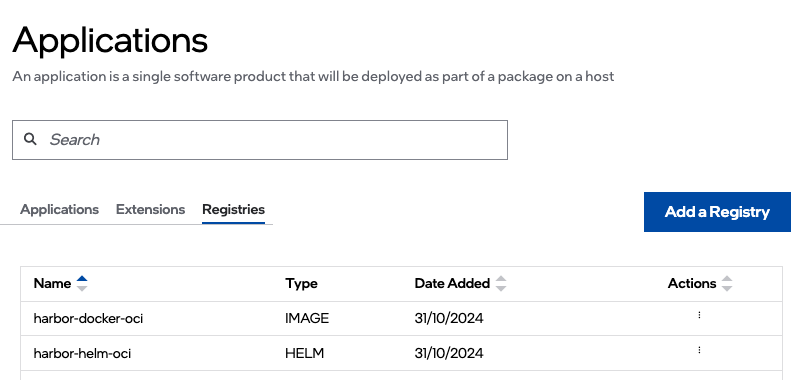

.. _registry:

Registry
===============================================
You can connect one or more registries to the |software_prod_name| service so you can easily add your applications to the service. There are two types of registries:

- **Helm\* Registries** hold Helm\* charts, packages consisting of YAML files and templates which convert into Kubernetes\* manifest files.
   Helm charts may refer to Docker\* images and/or a collection of files that describe a related set of Kubernetes resources.
   A single chart might be used to deploy something simple or something complex, like a full web application stack. The Helm chart typically specifies the names and locations of the images it loads.
- **Docker Registries** hold container images. Container images typically hold the executable binary that represents the application.
   This is inclusive of both containerized applications and virtual machines.

.. note::
   Intel recommends creating the Helm charts and noting the locations correctly so that the images are retrieved from the correct location when creating an application.

After setting up |software_prod_name|\ , by default, the "Internal Harbor" or "Internal Registry" is automatically created.
This Internal Registry is pre-populated and the necessary credentials to access it are created.

To view the available registries, click the **Deployments** tab and then click **Applications** on the left menu.
On the **Applications** page, click the **Registries** tab to view the available registries. You can also add a new registry by clicking **Add Registry**.

.. list-table::
   :widths: 20, 20
   :header-rows: 1

   * - Field
     - Description

   * - Name
     - Displays the name of the registry.

   * - Type
     - Displays the type of registry. It displays 'HELM' for Helm chart and 'IMAGE' for Docker images.

   * - Date Added
     - Displays the date when the registry was added to the service.

From this page, you can do the following tasks:

   * :doc:`/user_guide/package_software/add_registry`
   * :doc:`/user_guide/package_software/push_registry`
   * :doc:`/user_guide/package_software/image_pull_secret`
   * :doc:`/user_guide/package_software/edit_registry`
   * :doc:`/user_guide/package_software/package_create_helm`
   * :doc:`/user_guide/package_software/registry_security`

.. toctree::
   :hidden:

   package_create_helm
   add_registry
   push_registry
   image_pull_secret
   edit_registry
   registry_security

**Command Line Management**

For programmatic access and automation, you can use the orch-cli tool to manage registries.
For detailed command-line operations, see :doc:`/user_guide/package_software/orch_cli/orch_cli_guide`.
