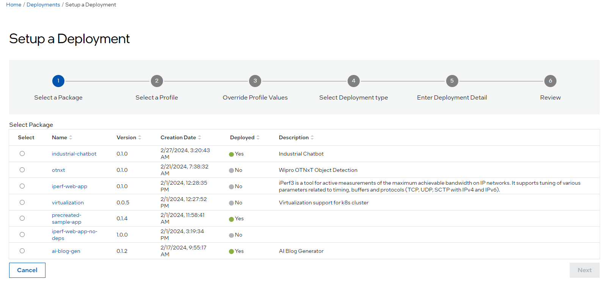
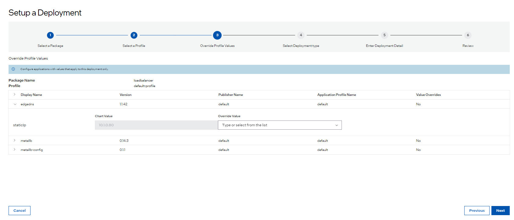

Set up a Deployment
===========================

You can set up two types of deployment:

-	**Automatic**: Automatic deployment automatically deploys the deployment package to any existing or newly added clusters with metadata that matches the metadata specified in the deployment setup.

-	**Manual**: In manual deployment, you can select the clusters where the deployment package will be deployed from the existing cluster list.

.. note::

   For more insights into how deployments are linked to hosts, see the
   :doc:`/user_guide/advanced_functionality/automated_deployment` section.

To set up a deployment, perform the following steps:

1. Select **Deployments** tab and click **Setup a Deployment** button. The **Setup a Deployment** page appears:

2. In the **Setup a Deployment** page, select a package or extension for deployment from the list, and click **Next**. The **Select a Profile** step appears.

3. In the **Select a Profile** step, select the deployment profile, and click **Next**. The **Override Profile Values** page appears.

4. The **Override Profile Values** page shows the deployment profile values that are available for overriding.
   Provide the necessary overriding values, then click **Next** to proceed to the **Select Deployment type** step.

5. In the **Select Deployment type** page, select the type of deployment.

   If you select **Automatic** as the deployment type, enter the deployment name and metadata in key-value format to select the target cluster.

   .. figure:: images/auto_deploy.png
      :alt: Automatic deployment

   If you select **Manual** as the deployment type, select the clusters from the list of clusters:

   .. figure:: images/manual_deployment.png
      :alt: Manual deployment

6. Click **Next** to view the **Review** page.

7. Verify if the deployment details are correct and click **Deploy**.

You can view the deployment on the **Deployments** page.

.. note::

   If the deployment fails for any reason, the deployment status will display the **Error** or **Down** status.
