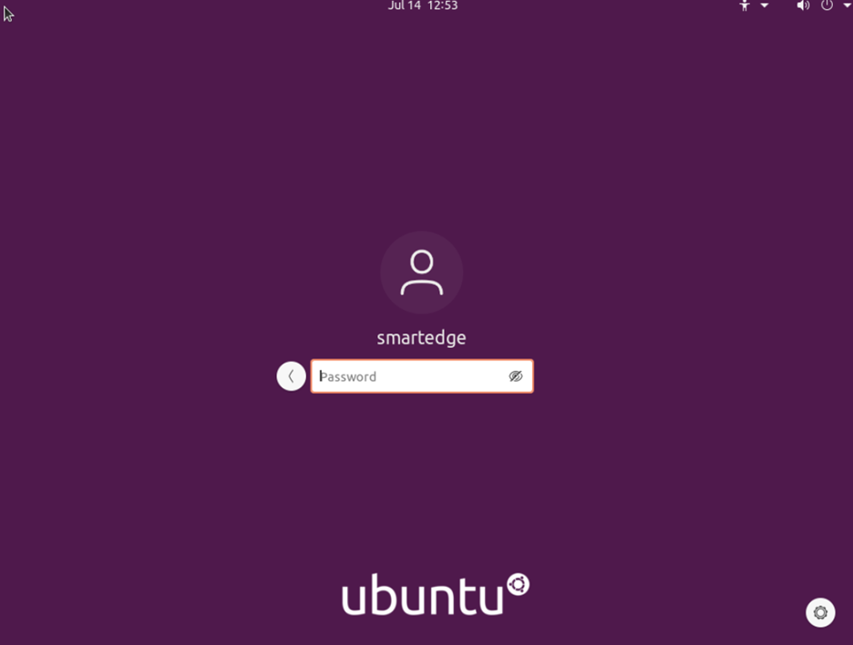

Perform Actions on the Virtual Machines
===========================================================

In the `View Deployment Instance Details <#view-deployment-instance-details>`__ page, you can view
the Virtual Machines (VMs) available in the cluster. To view the VMs, select
the application and click the **>** icon. It displays the list of VMs available
of the selected application in the cluster.

.. figure:: images/workload_view_vm-2.png
   :scale: 50 %
   :alt: List of VMs available

You can perform the following actions on each VM:

* **Start**: Use this option to start the VM.

  .. note::
     **Start** is an automatic action. Therefore, the VM starts by default.

* **Stop**: Use this option to stop the VM.
* **Restart**: Use this option to re-start the VM.
* **Console**: Use this option to remotely access the VM. For example, to
    configure and troubleshoot your application. A new window with a console will open:

  .. figure:: images/console_access.png
     :scale: 40 %
     :alt: Console access

The following is a remote desktop access screen:

