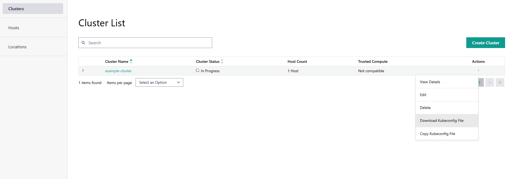

Organize Cluster Access with a Kubeconfig File
==============================================================================

A Kubeconfig file is a configuration file that defines and manages access to
Kubernetes clusters. It is a YAML file that stores cluster authentication information.

You can download or copy the Kubeconfig file to access clusters deployed on the edge node. To do so, go to the **Cluster List** page, select the cluster, and in the **Actions** column, click **Download Kubeconfig File**.

To copy the contents of the Kubeconfig file, go to the **Cluster List** page, select the cluster, and in the **Actions** column, click the three-dot icon and then click **Copy Kubeconfig File**.

