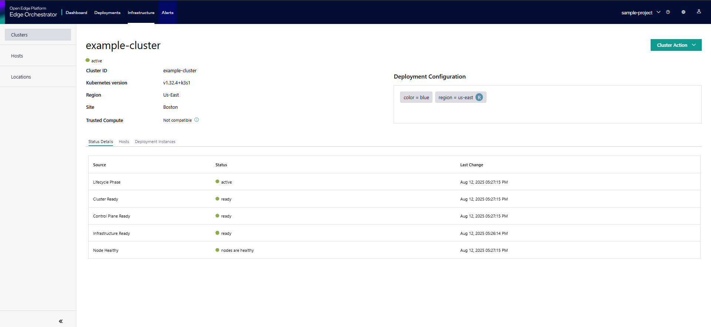

View Cluster Details
==========================

The **Cluster Details** page allows you to view the cluster information, such as cluster name, Kubernetes* version, cluster nodes' details, and cluster labels.
To view the details of the cluster, on the **Clusters** page, you can click the cluster's name or select **View Details**.

You can view the following details:

* **Cluster Name** - Displays the name of the cluster.
* **Cluster details** - Displays cluster details, such as status, cluster ID, Kubernetes version, region, and site.
* **Deployment Configuration** - Displays the metadata associated with the cluster.
* **Cluster Action** - Allows you to perform cluster actions like edit cluster,  delete the cluster, download kubeconfig file, and copy kubeconfig file.
* **Status Details** - Displays the status of the cluster.  The following statuses are shown.

   * **Lifecycle Phase** - Shows the lifecycle phase of the cluster.

       * **unknown** - Unable to determine current phase
       * **pending**- Cluster creation initiated but infrastructure not ready
       * **provisioning** - Resources are being created and configured
       * **provisioned** - Infrastructure is ready but components may still be initializing
       * **active** - Cluster is fully operational
       * **deleting** - Cluster is being removed
       * **failed** - Cluster creation has failed.

   * **Cluster Ready** - Shows the readiness of the cluster.

      * **ready** - Cluster core components fully functional
      * **not ready** - Cluster core still initializing
      * **unknown** - Status cannot be determined

   * **Control Plane Ready** - Shows the readiness of the control plane.

      * **ready** - Control plane fully functional
      * **not ready** - Control plane still initializing
      * **unknown** - Status cannot be determined

   * **Infrastructure Ready** - Shows the readiness of the infrastructure.
   
      * **ready** - Infrastructure fully functional
      * **not ready** - Infrastructure still initializing
      * **unknown** - Status cannot be determined

   * **Node Healthy** - Summarizes the health of the nodes in the cluster.
      
      * **nodes are healthy** - All nodes are operational and passing health checks
      * **node(s) health unknown (X/Y)** - Some nodes haven't reported health yet
      * **nodes are unhealthy (X/Y)** - One or more nodes have failed health checks

* **Hosts** - Displays the details of the host. For more information, see the
  :doc:`/user_guide/set_up_edge_infra/provisioned_host_details` page.
* **Deployment Instances** - Lists the instances of deployments, their status, and the number of applications running on a given cluster.

In the **Status Details** tab, a cluster in a healthy state will show all statuses as green as shown at the top of the page.
A cluster in an unhealthy state will show some statuses as red, with messages providing troubleshooting information.
In the following image, a single-node cluster is offline; the cluster's offline status can be inferred from the disconnected agents and unhealthy node.

