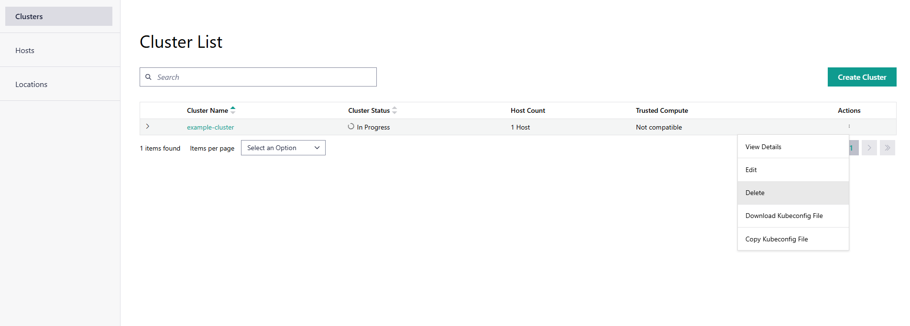

Delete Clusters
==================

To delete a cluster, do the following:

1. Click the **Infrastructure** tab at the top menu to view the **Clusters** page.
   On the **Clusters** page, you can view the following list of available clusters.

2. Click the three-dot (...) icon in the **Actions** column for the desired cluster
   and select **Delete**.

A window pops-up to confirm the deletion.

.. warning::

   Deleting a cluster will remove the cluster and all its associated resources.
   This action is irreversible, so ensure that you have backups or do not need the
   cluster before proceeding with the deletion.

.. note::

   Deleting a cluster will deauthorize the host in the cluster. To
   re-create a cluster on the same host, you must re-onboard it.
