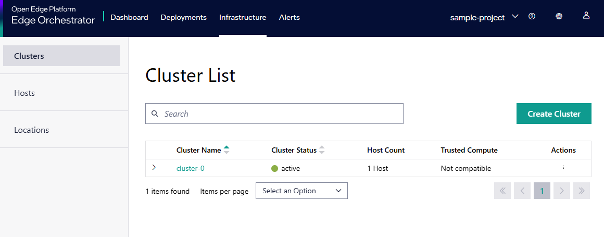
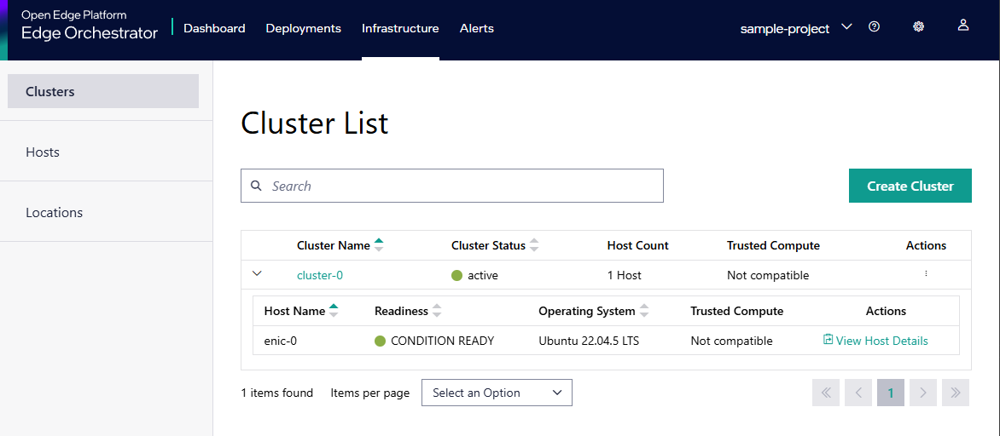

Clusters
====================================================================

A cluster (Kubernetes cluster in this context) is a group of physical or virtual
hosts that are managed as a single entity that runs containerized applications.
|software_prod_name| enables you to manage the following full life cycle of
clusters hosted on single or multiple edges:

* Create a cluster.
* Update existing clusters with new configurations or upgraded software
  versions.
* Monitor the state of clusters.
* Access clusters to troubleshoot or debug application deployments.
* Retire or remove clusters no longer required.

.. warning::

   **Multi-node cluster creation** is not supported at the moment.
   This limitation is expected to be resolved in a future release.

Clusters can be configured in two ways:

* Manually for hosts already onboarded and provisioned. For creating a cluster
  manually, see :doc:`/user_guide/set_up_edge_infra/clusters/create_clusters`.

* Automatically during the host onboarding process, where the cluster is created
  as part of the host configuration. This method is useful for single-node
  clusters and allows you to set up a cluster with minimal manual intervention.
  For creating a cluster while configuring a host, see
  :doc:`/user_guide/set_up_edge_infra/edge_node_onboard/onboarding_actions/provision_host`.

To manage and monitor clusters, you can view each cluster's details from the
**Clusters** page. To view the **Clusters** page, click the **Infrastructure**
tab on the top menu and select **Clusters** on the left menu. On the
**Clusters** page, you can view the list of available clusters.

You can view the following details of the cluster:

.. list-table::
   :widths: 20, 20
   :header-rows: 1

   * - Cluster Name
     - Displays the name of the cluster.

   * - Cluster Status
     - Indicates the state of the cluster. The available states are as follows:

       * **unknown** - Unable to determine current phase
       * **pending**- Cluster creation initiated but infrastructure not ready
       * **provisioning** - Resources are being created and configured
       * **provisioned** - Infrastructure is ready but components may still be initializing
       * **active** - Cluster is fully operational
       * **deleting** - Cluster is being removed
       * **failed** - Cluster creation has failed. Consult the
         :doc:`/user_guide/set_up_edge_infra/clusters/cluster_details`
         page for troubleshooting information.

   * - Host Count
     - Displays the number of hosts in the cluster.

   * - Trusted Compute
     - Displays whether if the cluster is compatible with the trusted compute
       feature. The trusted compute feature is only available for clusters
       created with the **Trusted Compute** option enabled.

   * - Actions
     - Click the three-dots (…) icon to perform the following actions:

       * Edit
       * View Details
       * Delete
       * Download Kubeconfig File
       * Copy Kubeconfig File

Click the **>** button to view the details of the hosts available
in the cluster. You can view details of the host like the status,
UUID, and serial number of the host. Click the **View Host Details**
link to view the host details.

From this page, you can do the following:

* :doc:`/user_guide/set_up_edge_infra/clusters/cluster_details`
* :doc:`/user_guide/set_up_edge_infra/clusters/create_clusters`
* :doc:`/user_guide/set_up_edge_infra/clusters/edit_clusters`
* :doc:`/user_guide/set_up_edge_infra/clusters/delete_clusters`
* :doc:`/user_guide/set_up_edge_infra/clusters/accessing_clusters`

.. toctree::
   :hidden:

   cluster_details
   create_clusters
   edit_clusters
   delete_clusters
   accessing_clusters

