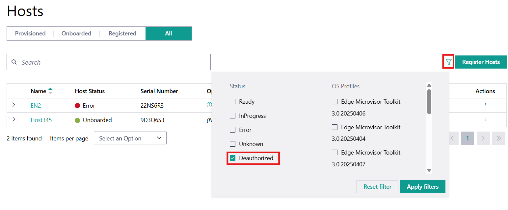

Deauthorize Host
=====================================================================

The **Deauthorize Host** feature removes the host's ability to access
the Edge Orchestrator service by revoking its security certificates.

.. note::
   Once Deauthorized, a host cannot communicate with Edge Orchestrator. The host
   must be fully re-provisioned to re-enable communication, starting with the
   remote installation. To onboard a host, see
   :doc:`/user_guide/set_up_edge_infra/edge_node_onboard` section.

1. Go to the **Infrastructure tab**, click **Hosts** on the left menu.

#. Go to the **Actions** column from any of the tabs and click the three-dot icon for the desired
   host. Click **Deauthorize**.

   .. figure:: images/deauthorize_host.png
      :alt: Deauthorize Host

   A confirmation screen appears where you can add the reason for deauthorizing the host:

   .. figure:: images/confirm_host_deauthorization.png
      :alt: Confirm Host Deauthorization

#. Click **Deauthorize**.

#. (Optional) Go to **Clusters** on the left menu and verify whether the host
   is removed from its cluster.

Once the node is deauthorized, it can be found in the **All** tab on the **Hosts**
page. Delete the host if you want to remove it from this page. To view only the
deauthorized hosts, you can use the filter option to select only the those hosts
in the deauthorized state:

