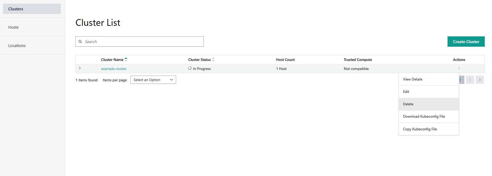

Delete Clusters
==================

To delete a cluster, do the following:

1. Click the **Infrastructure** tab at the top menu to view the **Clusters** page.
   On the **Clusters** page, you can view the following list of available clusters.

2. Click the three-dot (...) icon in the **Actions** column for the desired cluster
   and select **Delete**.

A window pops-up to confirm the deletion.

