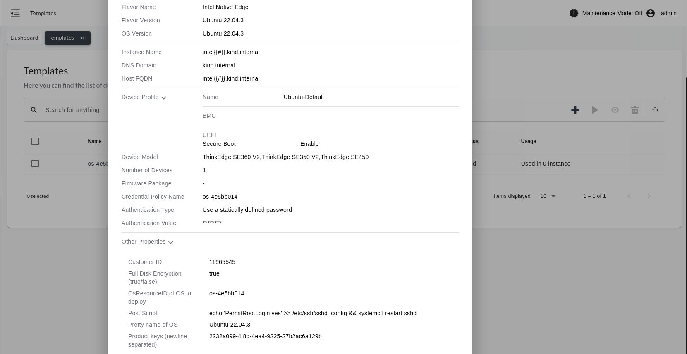

Set Up LOC-A
------------------------------

`Lenovo Open Cloud Automation (LOC-A) <https://www.lenovo.com/us/en/servers-storage/software/open-cloud-automation/>`_
is a modular automation framework designed to enable customers to easily deploy and manage
cloud solutions and workloads on Lenovo hardware.

.. note::
   This is a one-time setup.

Prerequisites
^^^^^^^^^^^^^^^^^^^^^^^^^^^^^^

Before setting up LOC-A, ensure that the installation process has been completed successfully and
that the Edge Infrastructure Manager Plugin* is installed correctly. Refer to the LOC-A installation section at
:doc:`/deployment_guide/on_prem_deployment/on_prem_get_started/on_prem_install` for detailed instructions.
Confirm that the LOC-A UI is accessible from your laptop. Log in into the LOC-A UI and proceed with the setup.

Set up LOC-A Cloud Template
^^^^^^^^^^^^^^^^^^^^^^^^^^^^^^

#. Download the cloud template example from
   `Lenovo ISG Support Plan - LOC-A (Lenovo Open Cloud Automation) <https://support.lenovo.com/us/en/solutions/ht509884-loc-a-lenovo-open-cloud-automation-for-vcf>`_
   to use with the deployed LOC-A version. This version of |software_prod_name|\  supports
   LOC-A 3.3.x. Alternatively, you can download the template file from the `Upload`
   tab in the `Setup` page:

   .. image:: ../../images/download-template.png
      :alt: Download the template from LOC-A 3.3
      :width: 750px

#. Set up a site that supports Edge Manageability Framework deployment by following the instruction
   defined in :doc:`/user_guide/set_up_edge_infra/location/index`. |software_prod_name|\  will
   automatically synchronize site metadata and |software_prod_name|\  Cloud Service with
   LOC-A, the latter will show in the UI with the relevant information:

   .. image:: ../../images/loca-site.png
      :alt: Set up a Site that Supports Edge Manageability Framework Deployment
      :width: 750px

   .. note::
      The site might not be ready if you did not set up the IP ranges and network
      services manually.

#. Use the cloud template downloaded at the first step, and set up IP ranges according to
   the network topology defined in :doc:`/deployment_guide/on_prem_deployment/on_prem_get_started/index`

.. list-table::
   :widths: 20, 20, 20, 20, 20, 20, 20, 20, 20
   :header-rows: 1

   * - Name
     - Site List
     - Role
     - Prefix
     - Vlan
     - IP Start
     - IP End
     - Default Gateway
     - IP Allocation Strategy
   * - BMC-range
     - Intel
     - Management
     - 192.168.202.0/24
     -
     - 192.168.202.2
     - 192.168.202.128
     - 192.168.202.1
     - LOC-A allocated
   * - OS-range
     - Intel
     - Management
     - 192.168.202.0/24
     -
     - 192.168.202.129
     - 192.168.202.249
     - 192.168.202.1
     - LOC-A allocated

.. note:: The IP ranges are associated with the name of the site created in the previous step.

#. Set up network services according to
   the network topology defined in :doc:`/deployment_guide/on_prem_deployment/on_prem_get_started/index`

.. list-table::
   :widths: 20, 20, 20, 20, 20, 20, 20
   :header-rows: 1

   * - Name
     - Role
     - Site List
     - IP/FQDN
     - Used for connectivity check
     - Connectivity check protocol
     - Num of retries in connectivity check

   * - Intel DNS
     - DNS
     - Intel
     - 192.168.202.250
     - Yes
     - DNS
     - 3

   * - Intel NTP
     - NTP
     - Intel
     - 192.168.202.250
     - Yes
     - NTP
     - 3

.. note:: The Network services are associated with the name of the site created in the first step.

#. Upload the cloud template using the `Upload` tab in the `Setup` section:

   .. image:: ../../images/upload.png
      :alt: Upload cloud template
      :width: 750px

   .. note:: Do not use Edge Microvisor Toolkit images with LOC-A.

Setup LOC-A Instance Template
^^^^^^^^^^^^^^^^^^^^^^^^^^^^^^

The instance template configuration step is mandatory to deploy an OS on any Lenovo device.
|software_prod_name|\  will automatically convert the Ubuntu\* system's Lenovo profile in
LOC-A instance templates (one for each device).

The summary of the creation will look like the following:

.. note:: Verify that the Ubuntu OS version 22.04.3 for Lenovo, is visible in
   :doc:`/user_guide/advanced_functionality/view_os_profiles`.

LOC-A setup is now completed. You can proceed with the onboarding and the provisioning of
servers using LOC-A. For more information about onboarding hosts, see
:doc:`/user_guide/set_up_edge_infra/edge_node_onboard/3rd_party_examples/loca_assisted_boot`.
