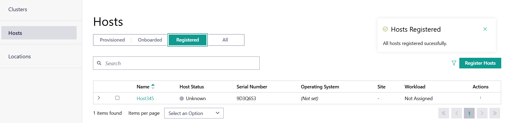
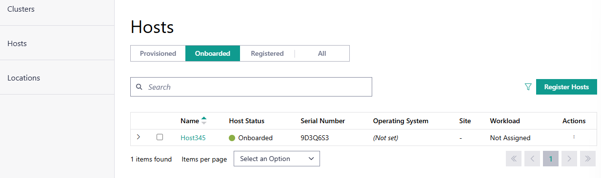
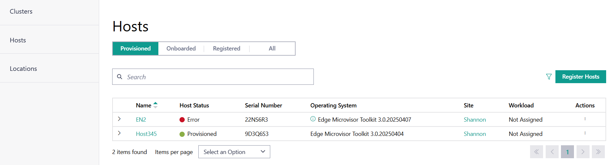

Verify Onboarding
==============================

Verify Successful Registration and Onboard Edge Node (Not required if Auto-Onboard is selected)
------------------------------------------------------------------------------------------------

#. Go to the |software_prod_name| user interface.
#. Click **Infrastructure** > **Hosts** and navigate to the **Registered** tab.
#. Verify that the new edge node is present with the status `Unknown`.

As an example, see host `Host345`:

Once the host connects to Edge Orchestrator, its status will change to `Connected`.

After you have successfully registered a host and it has connected to Edge Orchestrator,
you can proceed to onboard it by following the steps in
:doc:`/user_guide/set_up_edge_infra/edge_node_onboard/onboarding_actions/onboard_host`.

Verify Successful Onboarding
------------------------------------

#. Go to the |software_prod_name| user interface.
#. Click **Infrastructure** > **Hosts** and navigate to the **Onboarded** tab.
#. Verify that the new edge node is present.

After you have successfully onboarded a host, you can proceed to provision it by following
the steps in :doc:`/user_guide/set_up_edge_infra/edge_node_onboard/onboarding_actions/provision_host`

Verify Successful Provisioning
------------------------------------

#. Go to the |software_prod_name| user interface.
#. Click **Infrastructure** > **Hosts** and navigate to the **Provisioned** tab.
#. Verify that the new edge node is present.

If you receive an error when going through the previous steps, refer to
:doc:`/user_guide/troubleshooting/edge_node_onboard_troubleshooting`
for corrective actions.

Next Steps
-----------------------------

See the web UI for more options, and review the documentation.

* Web UI - \https://web-ui.CLUSTER_FQDN
* Documentation - \https://web-ui.CLUSTER_FQDN/docs/
