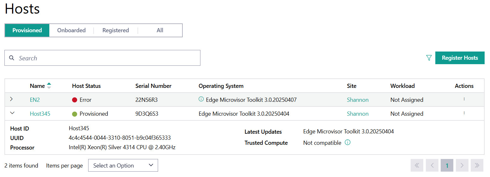
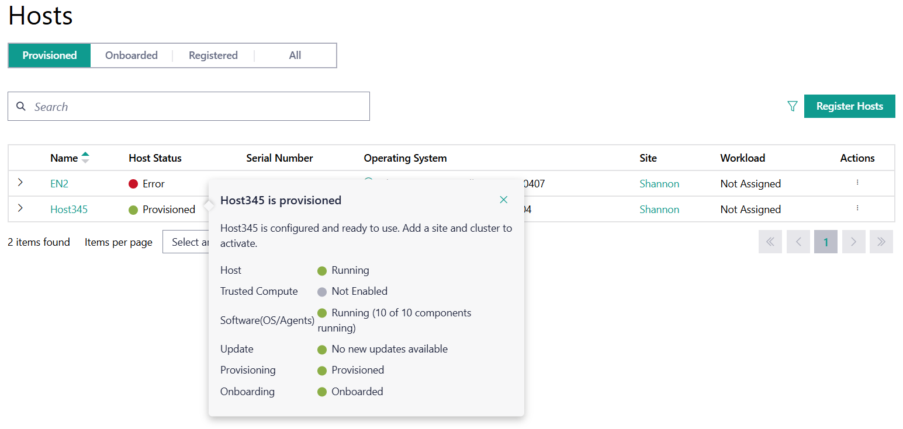
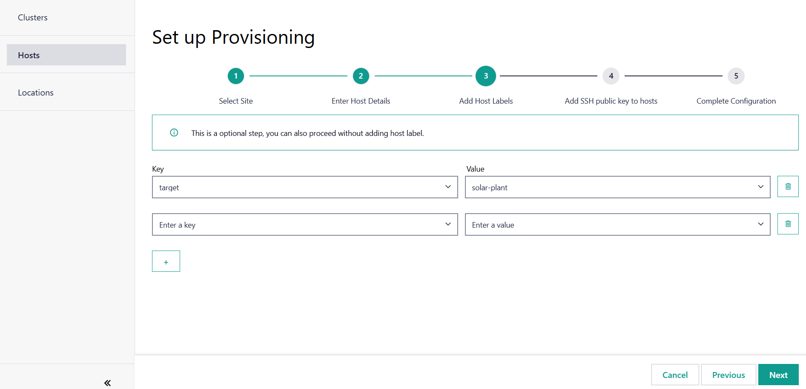

Provision Host
==============

The **Provision Host** feature allows you to provision an OS profile onto a previously onboarded host.

#. Go to the **Infrastructure tab**, click **Hosts** on the left menu and select the **Onboarded** tab:

   .. figure:: ../../images/onboarded_hosts.png
      :alt: Onboarded Hosts

#. Find a host in `Onboarded` state.

#. Go to the **Actions** column and click the three-dot icon for the desired
   host, then click **Provision**:

   .. figure:: ../../images/provision_host_action.png
      :alt: Provision Host

#. You will enter the Host Provisioning flow now. This flow has two steps - **Configure All Hosts** and **Review and Customize**. Any configuration that you make in the **Configure All Hosts** step will be applied to all hosts. Individual host configurations can be edited in the **Review and Customize** step.

   .. figure:: ../../images/provision_host_flow.png
      :alt: Provision Host Stepper Flow

#. Select the **site** that the host is connected to.

   .. figure:: ../../images/provision_host_site_selection.png
      :alt: Site Selection

#. Select the required **OS Profile** from the drop-down menu.

   .. figure:: ../../images/provision_host_os_profile_selection.png
      :alt: OS Profile Selection

#. If you came to this stepper flow from the :doc:`/user_guide/set_up_edge_infra/edge_node_onboard/edge_node_registration` page and you selected **Create Single-host Clusters**, you can pick the required **Cluster Template** and **Version** now. Otherwise, these two dropdowns will not be shown.

   .. figure:: ../../images/host_provision_cluster_template_selection.png
      :alt: Cluster Template Selection

#. Click **Advanced Options** to see more options that you can configure. This includes:

   * **vPro**: Enable or disable vPro on the host. The default option is `disabled`.
   * **Secure Boot and Full Disk Encryption**: Enable or disable secure boot and full disk encryption. The default option is `disabled`.
   * **SSH Key Name**: Select an SSH public key for login. It is optional to add an SSH key. However, you must have submitted the public key to the web UI using the instructions in :doc:`/user_guide/advanced_functionality/configure_ssh_public_keys`.
   * **Host Labels**: Add any optional host labels to the host.

   .. figure:: ../../images/provision_host_advanced_options.png
      :alt: Advanced Options

#. Click **Next** to proceed to the **Review and Customize** step. Here, you can review the configuration for all hosts and customize individual host configurations. You can expand each host to see more details.

   .. figure:: ../../images/provision_host_review_customize.png
      :alt: Review and Customize

#. If you want to customize the configuration for a specific host, click the three-dot icon next to the host, and then the **Edit** option.

   .. figure:: ../../images/provision_host_edit_host.png
      :alt: Edit Host

#. This will open a drawer with the saved host configurations. You can edit individual configurations as needed and click **Save** to apply the changes.

   .. figure:: ../../images/provision_host_edit_host_drawer.png
      :alt: Edit Host Drawer

#. Click **Provision** to finish the provisioning process.

Once the host is provisioned, you can find it in the **Provisioned** tab.
You can check the host details from this tab by using the drop-down menu for the host:

For details on the host status, hover over the status in the **Host Status** to bring up a menu showing the breakdown of the overall
host status:

Delete the host if you want to remove it from this page:

.. note::
   To create a cluster for an individual host, see
   :doc:`/user_guide/set_up_edge_infra/clusters/create_clusters`.

Operating System Profile
------------------------------------

Operating System Profile refers to the resources that describe the installation sources used.
They are used for performing initial installations as well as propagating updates to the installed operating systems.
They include information about the Operating System installation process, such as:

* kernel command parameters and options
* upstream packages and sources
* security features
* architecture

Additionally:

* Intel-provided packages, such as edge node Agents.
* Where and how updates to the OS can be obtained (update sources).
* Digests for integrity checks.
* User-defined names and descriptions.
* profile-name, which is used by the provisioning components.

.. note:: **Profile-name** is a unique identifier in the system.

**Update sources** is repeated free-form text, OS-dependent.

.. note:: Only Debian-style OSs are currently supported by this software version. Each repeated text must be in the `DEB822 <https://manpages.debian.org/bookworm/apt/sources.list.5.en.html>`_ format, which can embed the GNU Privacy Guard (GPG) key with the "Signed-By:" line.

For more information on OS and OS profiles, refer to
:doc:`/user_guide/advanced_functionality/view_os_profiles`.

Host Label
------------------------
The **Host Label** refers to additional host-specific metadata. This option allows you to specify constraints for which Kubernetes Pods are deployed to specific hosts through automated deployment.
Note that this is specified in the application's Helm chart.

You can use them as a slicing mechanism. For example, if you want your solar plant controller Pod to be scheduled only on the hosts connected to the plants,
you can specify this constraint as a special label identifying a subset of the hosts with this label. Hosts without this label would not receive this Pod.

In this example, `target=solar-plant` is specified as **Host Label**. For more information on leveraging the node labels and selectors in Kubernetes, see the `Kubernetes documentation <https://kubernetes.io/docs/concepts/scheduling-eviction/assign-pod-node/>`_.

.. toctree::
   :hidden:
