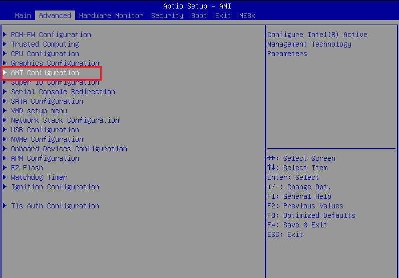

Disable Active Management Technology (AMT) for ASUS\* IoT PE3000G System
=============================================================================

.. _configure_amt_asus_start:

This guide outlines how to disable the Active Management Technology (AMT) for Asus ASUS\* IoT PE3000G System with BIOS version `1.01.00`.

To disable Active Management Technology (AMT), do the following:

1. Reboot the ASUS IoT PE3000G System.

2. Press the “Del” key to access the BIOS menu.

3. In the BIOS menu, proceed to `Advanced` tab with right arrow, then select `AMT Configuration` by using down arrow and click `Enter`.

4. In the `AMT Configuration`, select the `AMT BIOS Features` click `<Enter>` to select `Disabled`

   .. figure:: ../../../images/amt_bios_menu.png
      :alt: Disable AMT BIOS features
      :width: 100 %

10. Press 'F4' to save the changes and exit the BIOS menu. The system will reboot.

11. Confirm and enter the BIOS menu again. The `AMT BIOS Features` option is disabled. You can also check by `nmap` scanning on port 664/tcp, 16993/tcp, and 16995/tcp in `filtered` state.
