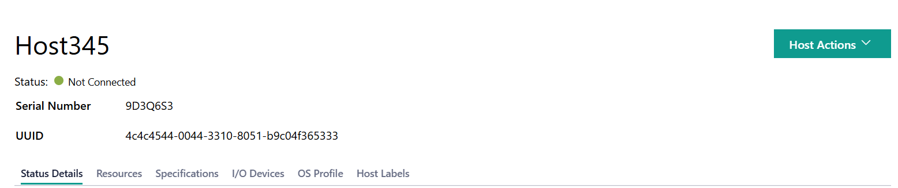
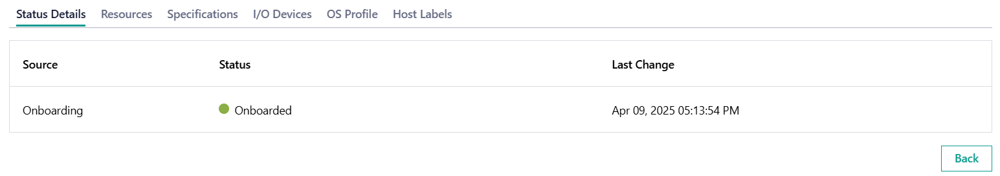
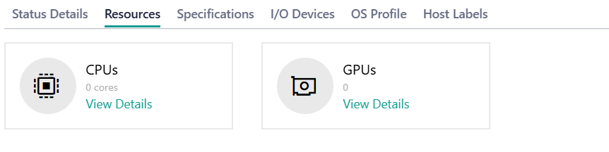
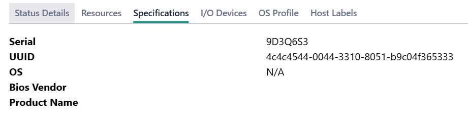
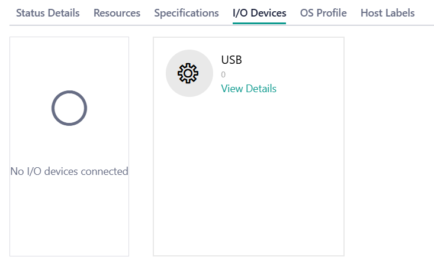
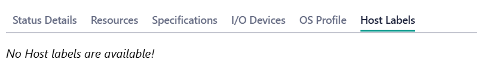

View Onboard Host Details
-------------------------

You can view the host details, including the status of the host, metadata, and
hardware details.

On the **Hosts** page, click the name of the host to view the host details.

.. list-table::
   :widths: 50 50
   :header-rows: 1

   * - Field
     - Description
   * - Serial Number
     - The serial number of the host.
   * - UUID
     - The UUID of the host.

View Status Details
^^^^^^^^^^^^^^^^^^^^^^^^^

Click the **Status Details** tab to view information about specific host hardware and software status:

.. list-table:: Host Hardware and Software Status
   :widths: 50 50
   :header-rows: 1

   * - Status
     - Description
   * - Onboarding
     - Status of host's onboarding process (for example, Booting, Onboarded).

View Host Resources
^^^^^^^^^^^^^^^^^^^^^^^^^

Click the **Resources** tab to view the host resources:

Click CPUs or GPUs to view the details of each resource.

.. list-table:: CPU Resources
   :widths: 50 50
   :header-rows: 1

   * - Field
     - Description
   * - Model
     - The model of the CPU.
   * - Cores
     - The number of cores of the CPU.
   * - Architecture
     - The architecture of the CPU.
   * - Threads
     - The number of threads of the CPU.
   * - Sockets
     - The number of sockets of the CPU.

.. list-table:: GPU Resources
   :widths: 50 50
   :header-rows: 1

   * - Field
     - Description
   * - Model
     - The model of the GPU.
   * - Vendor
     - The GPU vendor.
   * - Capabilities
     - The capabilities of the GPU.

View Host Specifications
^^^^^^^^^^^^^^^^^^^^^^^^^

Click the **Specifications** tab to view the host specifications:

.. list-table:: Host Specifications
   :widths: 50 50
   :header-rows: 1

   * - Field
     - Description
   * - Serial
     - The serial number of the host.
   * - UUID
     - The UUID of the host.
   * - OS
     - The operating system of the host.
   * - Bios Vendor
     - The vendor for the BIOS on the host.
   * - Product Name
     - The product name of the host.

View I/O Devices Details
^^^^^^^^^^^^^^^^^^^^^^^^^

Click the **I/O Devices** tab to view details of the I/O devices:

Click USB to view details of each resource.

.. list-table:: USB Devices
   :widths: 50 50
   :header-rows: 1

   * - Field
     - Description
   * - Class
     - The class code of the USB device.
   * - Serial
     - The serial number of the USB device.
   * - Vendor Id
     - The ID of the USB device vendor.
   * - Product Id
     - The ID of the USB device.
   * - Description
     - The description of the USB device.
   * - Bus
     - The number of Bus in the USB.
   * - Address
     - The unique identifier associated with the USB device.

View OS Profile
^^^^^^^^^^^^^^^^^^^^^^^^^

The **OS Profile** tab will be empty when the host is in `Onboarded` state.

View Host Label
^^^^^^^^^^^^^^^^^^^^^^^^^

Click the **Host Labels** tab to view the host label. For information about host
label, see :ref:`host label <user_guide/set_up_edge_infra/edge_node_onboard/onboarding_actions/provision_host:host label>`.

