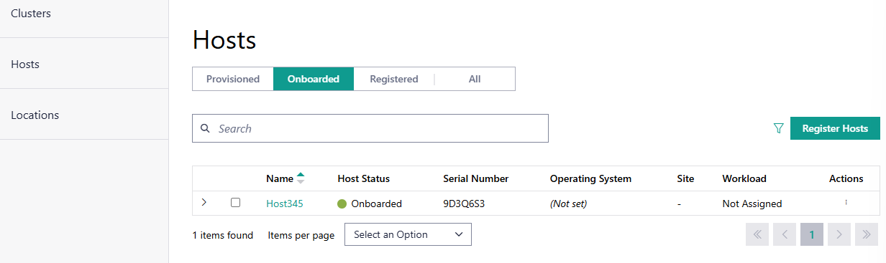

Onboarded Hosts
====================================================================

After completing the edge node onboarding process, onboarded nodes appear on
the Onboarded tab of the Hosts page. For more information on the onboarding process, see
:doc:`/user_guide/set_up_edge_infra/edge_node_onboard/index` section.

To view the **Hosts** page, click the **Infrastructure** tab and then
click **Hosts** on the left menu. On the **Onboarded** tab, you can
view the available onboarded hosts.
You can search for a host using the search bar at the top of the page.

Once onboarded, you can provision hosts with a custom name,
:ref:`Operating System Profile <user_guide/set_up_edge_infra/edge_node_onboard/onboarding_actions/provision_host:operating system profile>`
and security configuration,
:ref:`host label <user_guide/set_up_edge_infra/edge_node_onboard/onboarding_actions/provision_host:host label>`,
and associate them with their specific
:doc:`location </user_guide/set_up_edge_infra/location/index>`.

To provision a host, see the :doc:`/user_guide/set_up_edge_infra/edge_node_onboard/onboarding_actions/provision_host` section.

.. list-table::
   :widths: 20, 20
   :header-rows: 1

   * - Field
     - Description

   * - Name
     - Displays the name of the host.

   * - Host Status
     - Displays the status of the host. The status may be associated with the provisioning of necessary software, connection status, and so on. The following are the major statuses:

       * **Running** - The host is operating normally.
       * **No Connection** - The host cannot be accessed.
       * **Error** - One or more errors have been returned for the host.
         If there is a single error, the error source is shown.
       * **In Progress** - One or more processes for the host are in progress.
         If there is only one process, the source is shown.

   * - Serial Number
     - The serial number of the host system.

   * - Operating System
     - Displays the name of the operating system profile provisioned on
       the host.

   * - Site
     - Displays the site selected for the host during configuration.

   * - Workload
     - Shows the workload assigned to the host.

   * - Action
     - Click the three-dot icon to edit, provision, view metrics, delete, or deauthorize the host.

From this page, you can perform the following tasks:

* :doc:`/user_guide/set_up_edge_infra/edge_node_states/onboard_host_details`
* :doc:`/user_guide/set_up_edge_infra/edge_node_onboard/onboarding_actions/provision_host`
* :doc:`/user_guide/set_up_edge_infra/delete_host`
* :doc:`/user_guide/set_up_edge_infra/deauthorize_host`
