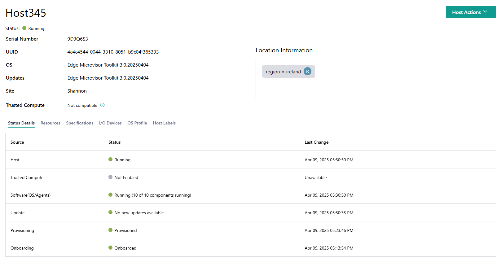

View Provisioned Host Details
-----------------------------

You can view the host details, including the status of the host, metadata,
and hardware details.

In the **Hosts** page, click on the name of the host to view the host details.

.. list-table:: Host Details
   :widths: 50 50
   :header-rows: 1

   * - Field
     - Description
   * - Serial Number
     - The serial number of the host.
   * - UUID
     - The UUID of the host.
   * - OS
     - The active OS on the host.
   * - Updates
     - Available OS update for the host.
   * - Site
     - The site of the host.
   * - Trusted Compute
     - Outlines if the host supports trusted compute or not.

View Status Details
^^^^^^^^^^^^^^^^^^^^^^^^^

Click the **Status Details** tab to view information about specific host hardware and software status:

.. list-table:: Host Hardware and Software Status
   :widths: 50 50
   :header-rows: 1

   * - Status
     - Description
   * - Host
     - Status of host's physical hardware. (for example, Running or No Connection).
   * - Trusted Compute
     - Status of trusted compute support on the host (for example, Enabled or Not Enabled).
   * - Software(OS/Agents)
     - Status of the OS and the edge node agents on the host (for example, Running (10 of 10 components running) or Error (9 of 10 components running)).
   * - Update
     - Status of host software update process (for example, Update in progress, or Updated).
   * - Provisioning
     - Status of operating system provisioning (for example, Provisioning in Progress, or Provisioned).
   * - Onboarding
     - Status of host's onboarding process (for example, Booting, or Onboarded).

View Host Resources
^^^^^^^^^^^^^^^^^^^^^^^^^

Click the **Resources** tab to view the host resources:

Click on CPUs, Memory, Storage, GPUs, or QAT to view details of each resource.

.. list-table:: CPU Resources
   :widths: 50 50
   :header-rows: 1

   * - Field
     - Description
   * - Model
     - The model of the CPU.
   * - Cores
     - The number of cores of the CPU.
   * - Architecture
     - The architecture of the CPU.
   * - Threads
     - The number of threads of the CPU.
   * - Sockets
     - The number of sockets of the CPU.

.. list-table:: Memory Resources
   :widths: 50 50
   :header-rows: 1

   * - Field
     - Description
   * - Size
     - The size of the memory.

.. list-table:: Storage Resources
   :widths: 50 50
   :header-rows: 1

   * - Field
     - Description
   * - WWID
     - The world-wide ID of the storage.
   * - Capacity
     - The capacity of the storage.
   * - Model
     - The model of the storage.
   * - Serial
     - The serial number of the storage.
   * - Vendor
     - The storage vendor.

.. list-table:: GPU Resources
   :widths: 50 50
   :header-rows: 1

   * - Field
     - Description
   * - Model
     - The model of the GPU.
   * - Vendor
     - The GPU vendor.
   * - Capabilities
     - The capabilities of the GPU.

View Host Specifications
^^^^^^^^^^^^^^^^^^^^^^^^^

Click the **Specifications** tab to view the host specifications:

.. list-table:: Host Specifications
   :widths: 50 50
   :header-rows: 1

   * - Field
     - Description
   * - Serial
     - The serial number of the host.
   * - UUID
     - The UUID of the host.
   * - OS
     - The operating system of the host.
   * - Bios Vendor
     - The vendor for the BIOS on the host.
   * - Product Name
     - The product name of the host.

View I/O Devices Details
^^^^^^^^^^^^^^^^^^^^^^^^^

Click the **I/O Devices** tab to view details of the I/O devices:

Click on USB or Interfaces to view details of each resource.

.. list-table:: USB Devices
   :widths: 50 50
   :header-rows: 1

   * - Field
     - Description
   * - Class
     - The class code of the USB device.
   * - Serial
     - The serial number of the USB device.
   * - Vendor Id
     - The ID of the USB device vendor.
   * - Product Id
     - The ID of the USB device.
   * - Description
     - The description of the USB device.
   * - Bus
     - The number of Bus in the USB.
   * - Address
     - The unique identifier associated with the USB device.

.. list-table:: Network Interface
   :widths: 50 50
   :header-rows: 1

   * - Field
     - Description
   * - Link Status
     - The status of the interface's link.
   * - MTU
     - Stands for Maximum Transmission Unit, which means the maximum payload that can be transmitted over an interface.
   * - Mac Address
     - The MAC address of the interface.
   * - Static IPs
     - The static IPs of the interface. Only shown when Link Status is UP and static IP address is assigned to the interface.
   * - Dynamic IPs
     - The dynamic IPs of the interface. Only shown when Link Status is UP and dynamic IP address is assigned to the interface.
   * - PCI Identifier
     - The identifier of the PCI-SIG\* compliant device
   * - SRIOV
     - The hardware standard for a PCI-SIG compliant device; either Enabled or Disabled.
   * - SRIOV VFS NUM
     - The number of virtual functions (VFs) enabled for the interface. Only shown when SRIOV is enabled.
   * - SRIOV VFS TOTAL
     - The maximum number of virtual functions (VFs) that can be enabled on the interface. Only shown when SRIOV is enabled.
   * - BMC Interface
     - Stands for Baseboard Management Controller Interface; either Yes or No.

View OS Profile
^^^^^^^^^^^^^^^^^^^^^^^^^

Click the **OS Profile** tab to view the OS profile details:

.. list-table:: OS Profile Details
   :widths: 50 50
   :header-rows: 1

   * - Field
     - Description
   * - Name
     - The name of the OS installed on the host.
   * - Profile Name
     - The name of the OS profile installed.
   * - Security Features
     - A list of the security features enabled by the OS profile.
   * - Architecture
     - The architecture of the host.

.. list-table:: Advanced Settings
   :widths: 50 50
   :header-rows: 1

   * - Field
     - Description
   * - Update Sources
     - The source location for updates.
   * - Repository URL
     - The repository URL where the OS image was pulled from.
   * - SHA-256
     - The SHA-256 sum for the OS image.
   * - Kernel Command
     - Command line options for the kernel on the host.

.. list-table:: System Overview
   :widths: 50 50
   :header-rows: 1

   * - Field
     - Description
   * - Installed Packages
     - The list of installed packages on the installed OS.
   * - Cves
     - The list of existing CVEs on the installed OS.

View Host Label
^^^^^^^^^^^^^^^^^^^^^^^^^

Click the **Host Labels** tab to view the host label. For information about host label,
see the `host label <./provision_host.html#host-label>`__ section.

