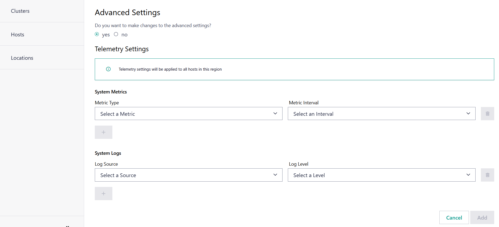

Add New Region
======================

Do the following to add a new region or subregion:

#. Go to **Infrastructure** > **Locations**.
#. If you want to add a new top-level region, click **Add a Region**. If no regions are present or **Add Region** on the top-right, if regions are already present.
#. If you want to add a sub-region to an already existing region, navigate to that top-level region, click the three dots on the right and then select **Add Subregion**.

   .. figure:: ../images/add_subregion.png

#. The **Add Region** page appears

   .. figure:: ../images/add_region.png
      :alt: Add new region

#. Enter the region **Name**. The name does not have to be unique.
#. Select the **Region Type**.
#. Select the **Parent Region**, if applicable.
#. Complete the advanced settings described below, if applicable.

Advanced Settings
-------------------

You have the option to collect additional telemetry data from the Edge Nodes allocated to the region and site.

For more details, see :doc:`../../../../shared/shared_howtos_advanced_settings`.

Finally, click **Add**. The new region will be listed on the Region page.

To know more about Telemetry Settings, see
:doc:`/user_guide/additional_howtos/region_site_telemetry`.

