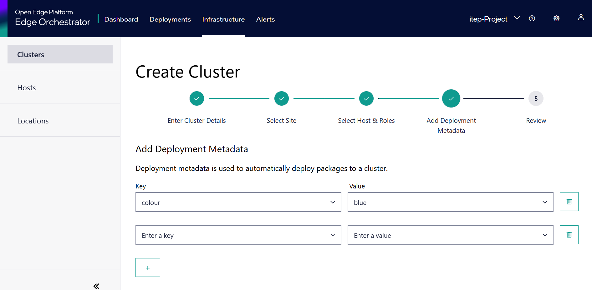

Add New Site
==================

To add a new site please do the following steps:

#. Go to **Infrastructure** > **Locations**.
#. Expand the hierarchy by clicking on `>` next to an existing region or sub region until you identify the desired region.
#. Click the three dots. Click **Add Site**

   .. figure:: ../images/add_site_button.png

#. The **Add Site** page appears.

   .. figure:: ../images/add_site.png
      :alt: Image of "Add New Site"

#. Enter the site **Name**.
#. Select the **Region** associated to the site.
#. Enter the **Latitude** and **Longitude** details.
#. Complete the `Deployment Metadata <#advanced-settings-deployment-metadata>`__
   and `Telemetry <#advanced_settings_telemetry>`__, if applicable.

Advanced Settings: Deployment Metadata
-----------------------------------------

You can add deployment metadata for the site. Choose the metadata category and select the corresponding value.

By default, the option to choose one metadata category is displayed. Click **Add Metadata** to add more metadata categories and values. Metadata follows the syntax defined `here <https://kubernetes.io/docs/concepts/overview/working-with-objects/labels/#syntax-and-character-set>`_.

Advanced Settings: Telemetry
-----------------------------

You have the option to collect additional telemetry data from the Edge Nodes allocated to the region and site.

.. figure:: ../images/advanced_settings.png
   :alt: Image showing additional telemetry data

For more details, see :doc:`../../../../shared/shared_howtos_advanced_settings`

Finally, click **Add**. The new site will be listed on the Site page.

To know more about Telemetry Settings, see
:doc:`/user_guide/advanced_functionality/region_site_telemetry`.
