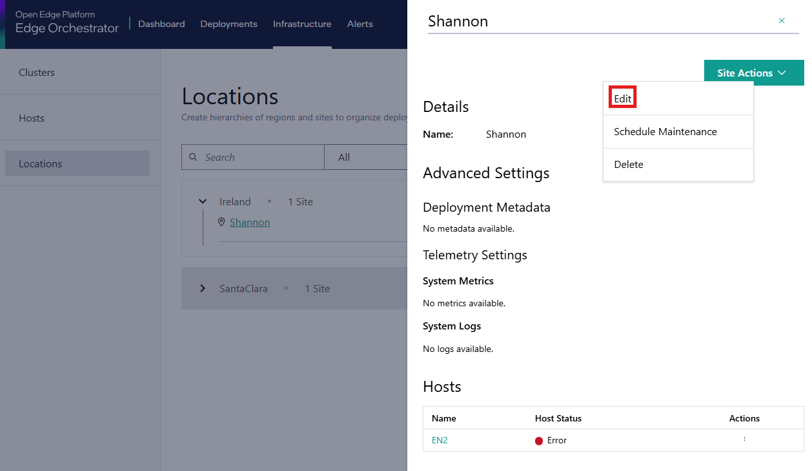

View and Edit Site Details
============================

To view the details of a site, do the following:

#. Go to the **Locations** page.
#. Expand the hierarchy by clicking on `>` next to an existing region or sub region until you identify the desired site.

   .. figure:: ../images/site_info_via_name.png

#. Click the name of the site. The **Site Details** pane appears.

   .. figure:: ../images/site_info_pane.png

The Site Details pane displays details such as the name, type, latitude, and longitude.

To edit site details, do the following:

#. Go to the **Locations** page.
#. Click on **Site Actions**, a dropdown menu appear. Click **Edit**.

The **Edit Site** page appears.

You can also make changes to the
`Deployment Metadata <./add_site.html#advanced-settings-deployment-metadata>`__
and `Telemetry <./add_site.html#advanced_settings_telemetry>`__.

