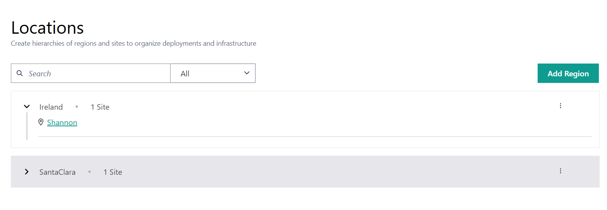

Locations
=========

Locations define the organizational structure of your regions and sites, helping you manage deployments and infrastructure more effectively.

To view the **Locations** page, go to **Infrastructure** > **Locations**. You will see the list of available regions. Click the ">" icon next to the region to reveal the sites.
You can also search for regions or sites using the search box.

**Regions**

Regions represent a physical area and are designed to adapt to your needs. As there are many ways to split up physical areas, |software_prod_name| allows you to implement your preferred scheme. For instance, regions can be:

* East and West groups
* Geopolitical boundaries such as North American States, Canadian Territories, Japanese Prefectures
* Based on time zone

Each region can also contain other regions, up to a five-layer hierarchy. A region can only have one parent region but
may contain multiple child regions. You cannot loop regions. For instance, if region A is the parent of region B, then region B cannot be the parent of region A.

This allows you to create a simple hierarchy. For example, East US > States > County > City, where East US is the parent region.

Regions without a parent are called Top Level or Root regions.

.. note::
   As Regions dynamically create metadata, they follow the same naming constraints as metadata (no capital letters or spaces).

**Sites**

Sites are locations where physical devices, such as Hosts, are present.
Sites represent a single physical location and have a single Region as a parent.

.. note::
   Site names may contain uppercase and lowercase characters, numbers, hyphens, slashes and spaces.

From this page, you can:

* :doc:`/user_guide/set_up_edge_infra/location/add_region`
* :doc:`/user_guide/set_up_edge_infra/location/view_region_detail`
* :doc:`/user_guide/set_up_edge_infra/location/delete_region`
* :doc:`/user_guide/set_up_edge_infra/location/add_site`
* :doc:`/user_guide/set_up_edge_infra/location/site_details`
* :doc:`/user_guide/set_up_edge_infra/location/delete_site`

.. toctree::
   :hidden:

   location/add_region
   location/view_region_detail
   location/delete_region
   location/add_site
   location/site_details
   location/delete_site

