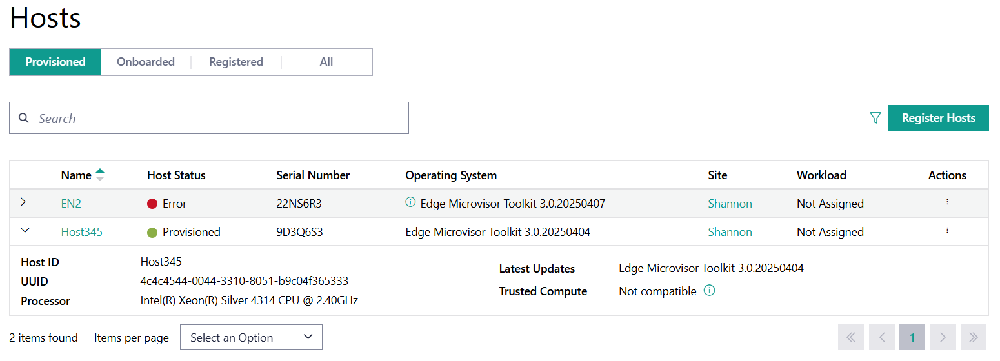
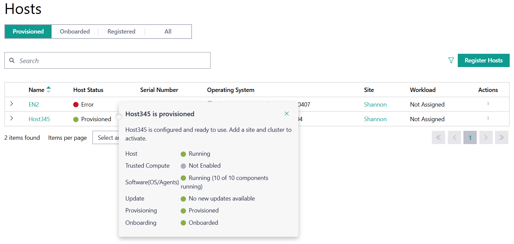

Provision Host
==============

The **Provision Host** feature allows you to provision an OS profile onto a previously onboarded host.

#. Go to the **Infrastructure tab**, click **Hosts** on the left menu and select the **Onboarded** tab:

   .. figure:: images/onboarded_hosts.png
      :alt: Onboarded Hosts

#. Find a host in `Onboarded` state.

#. Go to the **Actions** column and click the three-dot icon for the desired
   host, then click **Provision**:

   .. figure:: images/provision_host_action.png
      :alt: Provision Host

#. On the first page of the **Provision Set Up**, select the site the host is connected to and click **Next**.
   Click on the **>** option to expand a region to view the sites under it:

   .. figure:: images/provision_site.png
      :alt: Host Site

#. On the next page, select the required **OS Profile** from the drop-down menu. You can enable **Secure Boot** and
   **Full Disk Encryption** here if required, the default option is `disabled`. When finished, click **Next**.

   .. figure:: images/provision_os_profile.png
      :alt: Host OS Profile

#. Add any optional host labels to the host or skip if no labels are required, by clicking **Next**:

   .. figure:: images/provision_host_labels.png
      :alt: Host Labels

#. To enable SSH login using keys, select the required SSH public key from the drop-down menu and click **Next**.
   It is optional to add an SSH key, however you must have submitted the public key to the web UI using the instructions
   in :doc:`../../user_guide/advanced_functionality/configure_ssh_public_keys`.

   .. figure:: images/provision_os_public_ssh_key.png
      :alt: Host public SSH key

#. On the final page, review the details of the host to be provisioned and confirm that it is correct. If there are any errors,
   you can use the **Previous** option at the bottom of the page to navigate to the incorrect page. Click **Next** to accept
   the configuration and to provision the host. If you are configuring one host, you have the option to create a cluster
   for that host (the user must be a part of the :ref:`Project ID Edge Manager Group <shared/shared_iam_groups:<project-id>_edge-manager-group>`).

   .. figure:: images/default_cluster.png
      :alt: Default Cluster

Once the host is provisioned, you can find it in the **Provisioned** tab.
You can check the host details from this tab, using the drop-down menu for the host:

For details on the host status, hover over the status in the **Host Status** to bring up a menu showing the breakdown of the overall
host status:

Delete the host if you want to remove it from this page:

.. note::
   To create a cluster for an individual host, see
   :doc:`/user_guide/set_up_edge_infra/create_clusters`.

Operating System Profile
------------------------------------

Operating System Profile refers to the resources that describe the installation sources used.
They are used for performing initial installations as well as propagating updates to the installed operating systems.
They include information about the Operating System installation process, such as:

* kernel command parameters and options
* upstream packages and sources
* security features
* architecture

Additionally:

* Intel-provided packages, such as edge node Agents.
* Where and how updates to the OS can be obtained (update sources).
* Digests for integrity checks.
* User-defined names and descriptions.
* profile-name, which is used by the provisioning components.

.. note:: **Profile-name** is a unique identifier in the system.

**Update sources** is repeated free-form text, OS-dependent.

.. note:: Only Debian-style OSs are currently supported by this software version. Each repeated text must be in the `DEB822 <https://manpages.debian.org/bookworm/apt/sources.list.5.en.html>`_ format, which can embed the GNU Privacy Guard (GPG) key with the "Signed-By:" line.

For more information on OS and OS profiles, refer to
:doc:`/user_guide/advanced_functionality/view_os_profiles`.

Host Label
------------------------
The **Host Label** refers to additional host-specific metadata. This option allows you to specify constraints for which Kubernetes Pods are deployed to specific hosts through automated deployment.
Note that this is specified in the application's Helm chart.

You can use them as a slicing mechanism. For example, if you want your solar plant controller Pod to be scheduled only on the hosts connected to the plants,
you can specify this constraint as a special label identifying a subset of the hosts with this label. Hosts without this label would not receive this Pod.

.. figure:: images/configure_host_labels.png
   :alt: Add Solar Plant Host Labels

In this example, `target=solar-plant` is specified as **Host Label**. For more information on leveraging the node labels and selectors in Kubernetes, see the `Kubernetes documentation <https://kubernetes.io/docs/concepts/scheduling-eviction/assign-pod-node/>`_.

.. toctree::
   :hidden:
