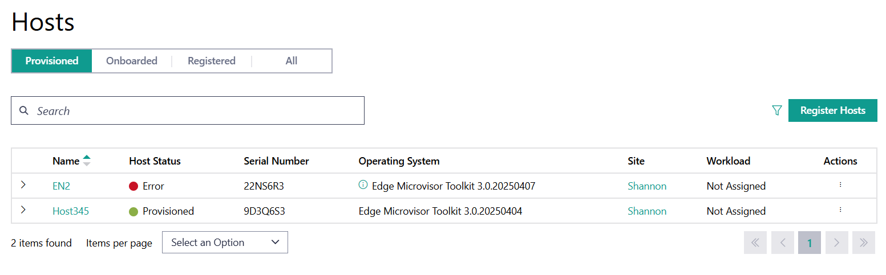

Provisioned Hosts
====================================================================

Provisioned hosts are hosts that are provisioned but are not yet part of a
cluster. On the **Hosts** page, you can view the list of the
provisioned hosts available. You can search for a host using the search bar
at the top of the page.

To view the **Hosts** page, click the **Infrastructure** tab and
click **Hosts** on the left menu.

.. list-table:: Provisioned Host Information
   :widths: 20, 20
   :header-rows: 1

   * - Field
     - Description

   * - Name
     - Displays the name of the host.

   * - Host Status
     - Displays the status of the host. The status may be associated with the rovisioning of necessary software, connection status, and so on. The following are the major statuses:

       * **Provisioned** - The host is operating normally.
       * **No Connection** - The host cannot be accessed.
       * **Error** - One or more errors have been returned for the host.
         If there is a single error, the error source is shown. When a host is provisioned, expect this status for a few minutes before it transitions to **Provisioned**.
       * **In Progress** - One or more processes for the host are in progress.
         If there is only one process, the source is shown.

       To view additional details on the Host Status, click on the status in the column to open up a menu showing the status of different components of the host:

       .. figure:: images/provision_host_status_menu.png
          :alt: Host Status Menu

   * - Serial Number
     - The serial number of the host system.

   * - Operating System
     - Displays the name of the operating system profile provisioned on
       the host.

   * - Site
     - Displays the site selected for the host during configuration.

   * - Workload
     - Shows the workload assigned to the host.

   * - Action
     - Click the three-dot icon to edit, schedule maintenance, view metrics, delete, or deauthorize the host.

Each host will also have a drop-down menu to view the Host Details.

.. list-table:: Provisioned Host Details
   :widths: 20, 20
   :header-rows: 1

   * - Field
     - Description

   * - HostID
     - The ID or name assigned to the host.

   * - UUID
     - The UUID of the host.

   * - Processor
     - The processor on the host.

   * - Latest Updates
     - Available OS updates for the host.

   * - Trusted Compute
     - Outlines if the host supports trusted compute or not.

From this page, you can do the following:

   * :doc:`/user_guide/set_up_edge_infra/provisioned_host_details`
   * :doc:`/user_guide/set_up_edge_infra/delete_host`
   * :doc:`/user_guide/set_up_edge_infra/edit_host`
   * :doc:`/user_guide/set_up_edge_infra/deauthorize_host`

.. toctree::
   :hidden:

   provisioned_host_details
   delete_host
   edit_host
   deauthorize_host

