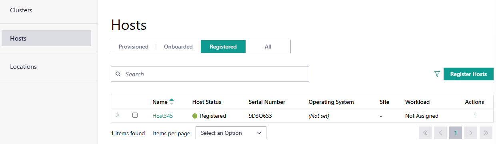
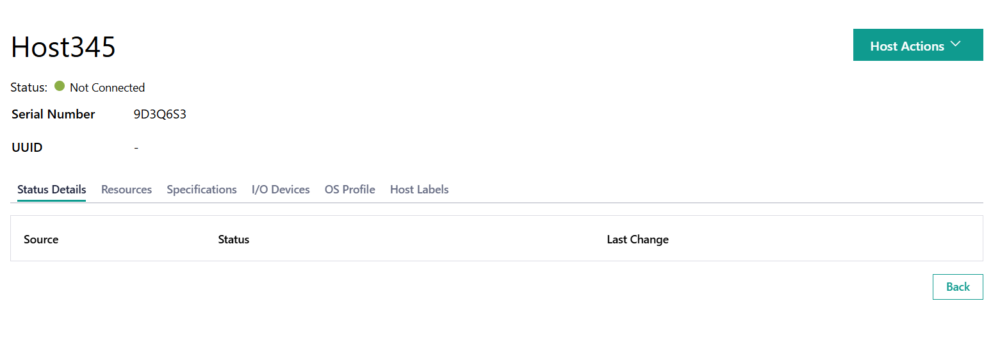

Registered Hosts
====================================================================

Registered hosts are hosts registered to the orchestrator but not yet connected or onboarded.

To view the **Hosts** page, click the **Infrastructure** tab and
then click **Hosts** on the left menu. On the **Registered** tab, you
can view the list of registered hosts and their status, search for a host
with the search box, view details, onboard, deauthorize, or delete hosts.

.. list-table::
   :widths: 20, 20
   :header-rows: 1

   * - Field
     - Description

   * - Name
     - Displays the name of the host.

   * - Host Status
     - Displays the status of the host. The status may be associated with the provisioning of necessary software, connection status, and so on. The following are the major statuses:

       * **Running** - The host is operating normally.
       * **No Connection** - The host cannot be accessed.
       * **Error** - One or more errors have been returned for the host.
         If there is a single error, the error source is shown.
       * **In Progress** - One or more processes for the host are in progress.
         If there is only one process, the source is shown.

       To view additional details on the Host Status, click on the status in the column to open up a menu showing the status of different components of the host:

       .. figure:: images/registered_host_status_menu.png
          :alt: Host Status Menu

   * - Serial Number
     - The serial number of the host system.

   * - Operating System
     - Displays the name of the operating system profile provisioned on
       the host.

   * - Site
     - Displays the site selected for the host during configuration.

   * - Workload
     - Shows the workload assigned to the host.

   * - Action
     - Click the three-dot icon to edit, onboard, delete, or deauthorize the host.

You can view the host details, including the status of the host, metadata, and hardware details.

For details, see :doc:`Registered Host Mismatch <../../shared/shared_registration_info_mismatch>`.

From this page, you can do the following:

    * :doc:`/user_guide/set_up_edge_infra/onboard_host`
    * :doc:`/user_guide/set_up_edge_infra/delete_host`
    * :doc:`/user_guide/set_up_edge_infra/edit_host`
    * :doc:`/user_guide/set_up_edge_infra/deauthorize_host`

View Registered Host Details
~~~~~~~~~~~~~~~~~~~~~~~~~~~~

On the **Registered** tab, click the name of the host to view the host details.

.. list-table::
   :widths: 50 50
   :header-rows: 1

   * - Field
     - Description
   * - Serial Number
     - The serial number of the host.
   * - UUID
     - The UUID of the host.
