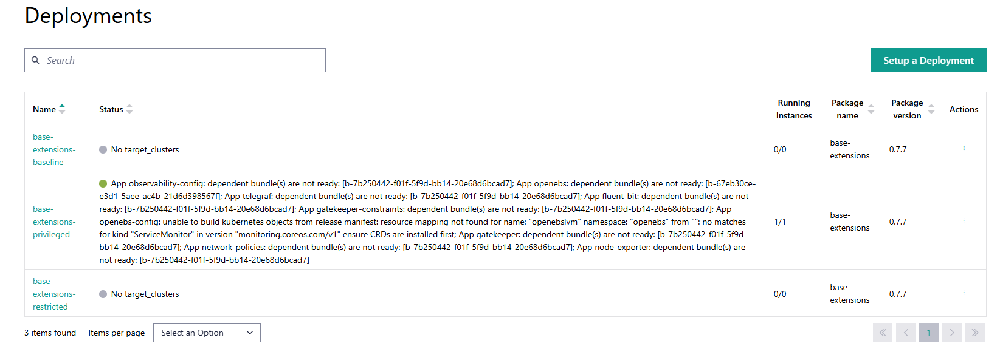

Deployment Issues
=======================

This section covers troubleshooting issues while deploying Edge Orchestrator.

* :ref:`failure_appinstall`
* :ref:`deploystatus_unknown`
* :ref:`o11y_grafana_mimir_querying_issue`
* :ref:`deploymentpage_errors`
* :ref:`redeployment_with_crds`
* :ref:`deployment_does_not_complete`

.. _failure_appinstall:

Failure of application installation
-----------------------------------------

**Symptom:** Failure of application installation. For example, the application
status does not transition to running within the Deployments menu.

.. note::
   This assumes the application has been properly tested and verified to be
   running in a lab environment.

**Solution:**

1. If the application does not launch successfully, look for error messages
   within the Deployments menu.
#. Verify Application, Deployment Package, and Deployment configurations.
#. If the deployment status remains as `No target_clusters`.
   a. Verify that the deployment metadata labels match the targeted cluster(s)
   labels.
   #. If the issue persists, contact Intel support for assistance.
#. If error message says "Internal error: 100.", then it could be either
   because of missing configuration in the deployment or because of hitting the
   limit of unique deployments. The maximum number of unique, i.e. different in
   applications chosen, deployments is limited to 1000 per Edge Orchestrator
   instance. Refer to the `Limitations` section in release notes
   :doc:`/release_notes/3.0/rel_notes_3.0`.
   If the number of unique deployments is lower
   than 300 there is no limit on the total amount of deployment replicas.
   Contact Intel engineering or support for assistance.
#. If error messages or configuration verification do not help, it is possible
   that there are broken Kubernetes\* cluster extensions. In this case, there
   is no end-user process for this condition. Contact Intel engineering or
   support for assistance.

.. _deploystatus_unknown:

The deployment status remains as *Unknown* within the Deployments menu
-----------------------------------------------------------------------

**Symptom:** The deployment status remains as `Unknown` within the Deployments
menu.

**Solution:** The cluster has a configurable periodic status check (default is
every 15 minutes). If the cluster is not reachable in that period, the
deployment status will become `Unknown`.

Check the cluster network connection and confirm that it can reach the
|software_prod_name|. Reference the
:doc:`/user_guide/set_up_edge_infra/clusters_main` page for more information.
If the issue persists, contact Intel support for assistance.

.. toctree::
   :hidden:

   o11y_grafana_mimir

.. _deploymentpage_errors:

Deployments page shows continuous errors after deleting a cluster
-----------------------------------------------------------------

**Symptom:** deployments page shows continuous errors after deleting a cluster even through
there are other installations of the application/extension successfully running on other clusters.

**Solution:**
   If you see a deployment error in the UI, it may be due to a bundle
   deployment that is still present in the management cluster, even though the
   fleet cluster has been deleted. Follow the commands here to do a cleanup

1. Here's a command that does the following:

   - Lists only `bundledeployments` where
     `status.conditions[].reason == "Error"`
   - Prints:
     - `bundle-deployment-namespace`
     - `project-id`
     - `fleet-cluster`

   .. code-block:: bash

      echo "bundle-deployment-namespace, project-id, fleet-cluster" && \
      kubectl get bundledeployments --all-namespaces -o json | \
      jq -r '
      .items[] |
      select(
         .status.conditions != null and
         (.status.conditions[]?.reason == "Error")
      ) |
      "\(.metadata.namespace)," +
      (.metadata.labels["app.edge-orchestrator.intel.com/project-id"] // "Not Found") + "," +
      (.metadata.labels["fleet.cattle.io/cluster"] // "Not Found")
      ' | sort | uniq

   **Sample output when such bundle deployments exist:**

   .. code-block:: text

      bundle-deployment-namespace, project-id, fleet-cluster
      cluster-bff2b105-16d5-44e7-a1d1-d7eca454af5e-emt-privileg-3b325,\
      bff2b105-16d5-44e7-a1d1-d7eca454af5e,emt-privileged

   **Sample output when no such bundle deployments exist:**

   .. code-block:: text

      bundle-deployment-namespace, project-id, fleet-cluster

2. You can cross-verify via the UI or by checking the project to confirm if the
   cluster exists. If the cluster does **not** exist, you may proceed to delete
   the `bundle-deployment` namespace.

3. Delete the `bundle-deployment` namespace to clean up bundles. For the above
   example:

   .. code-block:: bash

      kubectl delete ns \
      cluster-bff2b105-16d5-44e7-a1d1-d7eca454af5e-emt-privileg-3b325

**Optional Additional Cleanup:**
   If you want to perform a clean-up of all the deployment-bundles which are not
   being used by any of the Clusters. Follow the steps here to do a cleanup

4. Here's a command which does the following:

   - Lists only those bundle deployments for which the fleet cluster does
     **not** exist in the management cluster.
   - Prints:
     - `bundle-deployment-namespace` (with count of all the bundles in this ns)
     - `fleet-cluster-name`
     - `project-id`

   .. code-block:: bash

      echo "bundle-deployment-namespace (count), fleet-cluster, project-id" && \
      kubectl get bundledeployments --all-namespaces -o json | \
      jq -r '
      .items[] |
      select(
         .metadata.labels["fleet.cattle.io/cluster"] != null and
         .metadata.labels["app.edge-orchestrator.intel.com/project-id"] != null
      ) |
      {
         namespace: .metadata.namespace,
         fleet_cluster: .metadata.labels["fleet.cattle.io/cluster"],
         project_id: .metadata.labels["app.edge-orchestrator.intel.com/project-id"]
      } |
      "\(.namespace),\(.fleet_cluster),\(.project_id)"
      ' | while IFS=, read ns fc pid; do
      if ! kubectl get clusters.fleet.cattle.io --all-namespaces --no-headers \
            -o custom-columns=":metadata.name" | grep -q "^$fc$"; then
         echo "$ns,$fc,$pid"
      fi
      done | sort | uniq | while IFS=, read ns fc pid; do
      count=$(kubectl get bundledeployments -n "$ns" --no-headers 2>/dev/null \
            | wc -l)
      echo "$ns ($count), $fc, $pid"
      done

   **Sample output when such bundle deployments exist:**

   .. code-block:: text

      bundle-deployment-namespace (count), fleet-cluster, project-id
      cluster-bff2b105-16d5-44e7-a1d1-d7eca454af5e-emt-privileg-3b325 (13), \
      emt-privileged, bff2b105-16d5-44e7-a1d1-d7eca454af5e

   **Sample output when no such bundle deployments exist:**

   .. code-block:: text

      bundle-deployment-namespace (count), fleet-cluster, project-id

5. You can cross-verify via the UI or by checking the project to confirm if the
   cluster exists. If the cluster does **not** exist, you may proceed to delete
   the `bundle-deployment` namespace.

6. Delete the `bundle-deployment` namespace, which will clean up all associated
   bundles. For the example above:

   .. code-block:: bash

      kubectl delete ns \
      cluster-bff2b105-16d5-44e7-a1d1-d7eca454af5e-emt-privileg-3b325

.. _redeployment_with_crds:

Redeploying Application fails with `metadata annotation` error
--------------------------------------------------------------------

**Symptom:** Redeploying an application or extension fails with an error like
`App <name>: not installed: Unable to continue with install: <resource name and type>
in namespace <ns> exists and cannot be imported into the current release: invalid
ownership metadata: annotation validation error: key "meta.helm.sh/release-name"
must equal "<new bundle name>": current value is "<old bundle name>"`

**Solution**: This error occurs when the application or extension contains CRDs
or other cluster-level resources and has previously been deployed and undeployed,
and is being redeployed. The previous deployment may have left behind some resources
and these are annotated with the previous installations bundle name, and will not
be removed or overwritten by the new deployment.

The simplest solution is to delete the cluster and create it again, and then
deploy the application. If this is not desirable, then:

#. Get kubectl connectivity to the Edge Node where the application is being
   deployed. See :doc:`../set_up_edge_infra/accessing_clusters`

#. Inspect the resources named in the error, and delete them. Check that the
   resource does indeed have the old bundle name in its annotations before deleting.

#. Once all are deleted, try the redeployment again.

.. _deployment_does_not_complete:

Deployment does not complete
------------------------------------------------

**Symptom:** The deployment does not complete, and the status remains as `In Progress`.

**Solution:**

1. Check the status of the deployment in the Deployments menu.
#. If the status is `In Progress`, it means that the deployment is still being processed.
#. Wait for a few minutes and refresh the page to see if the status changes.
#. If the status remains `In Progress` for an extended period, check the logs of
   the deployment to see if there are any errors.
#. Check the BundleDeployment objects on the Orchestrator. There should be one
   BundleDeployment object for each Application in the deployment. Use the
   Describe command to check the status of each BundleDeployment object
#. If the BundleDeployment description displays an `Error` it is possible that
   something is changing a values outside of that specified in the Helm chart manifest.
#. Examine the object mentioned in the error to see if it has extra `metadata` or
   `data` or `spec` that was added by some other process or operator.
#. Try adding an `ignoredResources` entry to the Application manifest
   to ignore this resource. This will allow the deployment to continue without
   failing due to this resource. See :doc:`/developer_guide/application_developer_workflow/deployment-packages/application-yaml-reference`
   for more information on the `ignoredResources` field.
