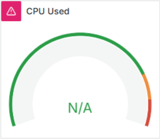

.. _o11y_grafana_mimir_querying_issue:

Grafana Mimir\* Software Query Issue
====================================

Symptom
-------

When attempting to view dashboards in Grafana UI, all panels indicate an error.

The red exclamation mark icon appearing on dashboard panel means that there
is an error returned from Grafana Mimir software when querying metrics. Error
messages may vary, but the most common are:

* Error upstream **connect error** or disconnect/reset before headers.
  reset reason: **connection failure**, transport failure reason: delayed
  connect error: **111**
* Error Plugin

Cause
-----

This issue is most often caused by an error in the ``querier`` service in
Grafana Mimir software. The issue can occur in both stacks that use
Grafana Mimir software:

* ``edgenode-observability`` exposed at ``observability-ui.<FQDN>``
* ``orchestrator-observability`` exposed at ``observability-admin.<FQDN>``

The underlying root cause is unknown, but the issue can be identified when:

* the connection between ``query-frontend`` and ``querier`` is broken
* the setup is unable to heal by itself (reconnect)

Sample extract from ``query-frontend`` logs that indicates broken connection:

.. code-block:: text

    ts=2025-03-01T03:53:52.014590133Z caller=mimir.go:868 level=info msg="Application started"
    ts=2025-03-01T07:52:37.568742517Z caller=spanlogger.go:109 level=error msg="error processing request" try=0 err="rpc error: code = Canceled desc = context canceled"
    ...
    ts=2025-03-01T07:52:57.48044312Z caller=frontend.go:358 level=info msg="not ready: number of queriers connected to query-frontend is 0"

Solution
--------

The issue cannot be fixed automatically and requires manual intervention.
Restart the affected Deployment using ``kubectl``:

.. code-block:: bash

   # Restart the querier in edgenode-observability
   kubectl rollout restart deployment/querier -n orch-o11y

   # Or restart query-frontend
   kubectl rollout restart deployment/query-frontend -n orch-o11y

If the issue is in orchestrator-observability, replace the namespace accordingly:

.. code-block:: bash

   kubectl rollout restart deployment/querier -n orch-platform

