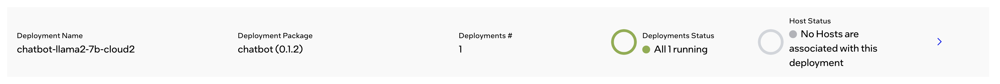

Operating Issues
========================

This section covers operating operating issues related to connectivity,
hardware, or applications of Edge Orchestrator.

* `Host has been tampered with by someone obtaining physical access to it <#host-has-been-tampered-with-by-someone-obtaining-physical-access-to-it>`__
* `Failure of HW or Hard Drive failure <#failure-of-hw-or-hard-drive-failure>`__
* `Failure of Network Card, Power Supply, Ethernet cable, or SFP+ <#failure-of-network-card-power-supply-ethernet-cable-or-sfp>`__
* `Failure of HW, USB ports/PCIe USB express card <#failure-of-hw-usb-ports-pcie-usb-express-card>`__
* `Degradation of system performance <#degradation-of-system-performance>`__
* `USB peripherals do not connect to the appropriate application <#usb-peripherals-do-not-connect-to-the-appropriate-application>`__
* `Network peripherals cannot connect to the appropriate application <#network-peripherals-cannot-connect-to-the-appropriate-application>`__
* `Network connection between Edge Orchestrator and the Host <#network-connection-between-software-prod-name-and-the-host>`__
* `Unexpected host reboot <#unexpected-host-reboot>`__
* `HW failure of the entire host <#hw-failure-of-the-entire-host>`__
* `The installed VM application does not provide the desired functionality <#the-installed-vm-application-does-not-provide-the-desired-functionality>`__
* `VM is not responding <#vm-is-not-responding>`__
* `Cannot connect to VM through VNC console or through SSH <#cannot-connect-to-vm-through-vnc-console-or-through-ssh>`__
* `Ingress of VMs does not work <#ingress-of-vms-does-not-work>`__
* :ref:`user_guide/package_software/interconnect:troubleshooting interconnect`
* `Docker\* Hub returns a 429 Too Many Requests error <#docker-hub-returns-a-429-too-many-requests-error>`__
* `Host has error status immediately after provisioning <#host-error-status-after-provision>`__
* `Application VM can't connect to it's cloud counterpart (Exceeded MTU) <#application-vm-can-t-connect-to-it-s-cloud-counterpart-exceeded-mtu>`__
* `Deployment is not getting installed due to updated Host metadata after first`
  `Host configuration to trigger ZTP <#deployment-is-not-getting-installed-due-to-updated-host-metadata-after-first-host-configuration-to-trigger-ztp>`__

Host has been tampered with by someone obtaining physical access to it
---------------------------------------------------------------------------------

**Symptom:** Host has been tampered with by someone obtaining physical access
to it.

**Solution:**

#. Bring down the host by going into the **Infrastructure** menu. Select the
   **Actions** menu for the host and click **Activate Maintenance**.

#. The resolution is to reinstall the entire host software stack. There is
   no end-user process for this condition. Contact Intel engineering or
   support for assistance.

Failure of HW or Hard Drive failure
--------------------------------------

**Symptom:**  Failure of HW or Hard Drive failure

**Solution:**

    1. Address the physical failure if the host (fix/replace)
    2. The recovery for this condition is to reinstall the entire host software
       stack. There is no end-user process for this condition. Contact Intel
       engineering or support for assistance.
    3. Configure the new host with the same Region, Site and Deployment
       Metadata as the prior host.

Failure of Network Card, Power Supply, Ethernet cable, or SFP+
------------------------------------------------------------------

**Symptom:**  Failure of Network Card, Power Supply, Ethernet cable, or SFP+
with system still fully operational beyond the specific hardware issue.

**Solution:**

    1. Address the hardware or physical failure
    2. |software_prod_name| software service will automatically synchronize
       and push the configuration to the host (that is, this condition is
       treated the same as a network disconnection)

Failure of HW, USB ports/PCIe USB express card
------------------------------------------------------------------

**Symptom:**  Failure of HW, USB ports/PCIe USB express card.

**Solution:**

#. Address the hardware or physical failure by checking applications and
   peripherals.
#. |software_prod_name| service will automatically synchronize and push the
   configuration to the host (that is, this condition is treated the same as a
   network disconnection)

Degradation of system performance
------------------------------------------------------------------

**Symptom:**  Degradation of system performance - System is up and functioning,
but the applications are very slow or otherwise impaired. For example, low disk
space causing performance issues.

**Solution:**

#. Observe the performance metrics dashboard for the host by performing the
   following steps:

  a. Go to the **Infrastructure** menu.
  #. Select the impaired host.
  #. Click the three dot menu and select **Performance Metrics**. Use the
     metrics dashboard to identify issues. (for example, high RAM usage by a
     specific application).

#. If an issue is not apparent, try rebooting the host.

USB peripherals do not connect to the appropriate application
------------------------------------------------------------------

**Symptom:**  USB peripherals do not connect to the appropriate application.

**Solution:** Navigate to the Deployment and the desired Deployment Instance.
Click on the Cluster related to the deployment in question. Open the VM Console
for the cluster and check if USB is detected inside the VM by running `lsusb`
in the VM console. If USB is detected, it is likely the application has an
issue. If not, unplug and re-plug the USB dongle and restart the VM.

.. note:: If the USB connection issues happen after a node reboot further
          operations need to happen to ensure proper functionality, contact
          Intel support for that.

Network peripherals cannot connect to the appropriate application
--------------------------------------------------------------------

**Symptom:** Network peripherals (for example, screens and cameras) cannot
connect to the appropriate application.

**Solution:** At the moment we do not have any ingress/egress policies for
applications, meaning accept all policies.

#. If external network entities cannot access applications using the
   provided FQDN, it might be a DNS configuration issue on the client
   device. Verify that the client device is set to the EdgeDNS IP that
   Intel provided.
#. If the DNS is configured properly but cannot resolve the address, it
   could be an EdgeDNS issue or network issue.
   To further identify the issue, access the application with
   load balancer IP address.

  a. If load balancer IP works, it is an EdgeDNS issue and Intel needs to
     assist in the resolution.
  #. The load balancer IP not working is likely due to a network issue
     between the host and the client device, which requires further
     debugging. Check the DNS, network, and firewall configuration.

Network connection between |software_prod_name| and the Host
--------------------------------------------------------------------

**Symptom:** Network connection between |software_prod_name| and the Host is
severed for any of the following reasons:

       -         |software_prod_name| is down
       -         There is a physical fiber connectivity loss
       -         NIC card issues.

**Solution:** If the host reconnects with |software_prod_name| with the same
state, host availability post re-connection is almost immediate. This also
assumes |software_prod_name| did not perform any changes.

If changes did occur, they will be applied after re-connection and
availability will depend on the amount and type of changes.  The host is also
designed to operate with no connectivity and |software_prod_name| has a
periodic 10s check.  If the host is not reporting after 10s, its status will
get updated as unreachable.

In this case, contact Intel for assistance.

The system does not need to be re authenticated when it comes back online
unless the token expires.

Given it is mutual TLS (mTLS) based, the length of token duration can be configured in
Keycloak solution. Client certificate has a 60 day duration.

Logs are stored on the host up to 25MBs (5MB times 5 tail plugins) per k8s
container, including host containers. (VM and application logs do not exist
in |software_prod_name| ). After the 25MB per pod limit is reached, the log
collection will be interrupted until |software_prod_name| is connected back
to the host.

Then the logs up to the 25MBs will be sent to |software_prod_name| and
collection will start again.

The amount of time for the log collection depends on how fast the 25Mbs
fills up, so there are no 24 or 48 hour guarantees, given no disk
persistency of the logs is provided.

.. note:: Node configuration is automatically checked by the
         |software_prod_name| and reinstalled, if required.

Unexpected host reboot
--------------------------------------------------------------------

**Symptom:** Unexpected host reboot.

**Solution:** Configuration of the host (for example, cluster, applications,
and so on) is re-synced and reapplied from automatically.
This does not Include VM internal data which could be lost if the VMs did not
store it physically on their drive. If the VM needs to be reinstalled, the data
will be lost unless is backed up.

HW failure of the entire host
--------------------------------------------------------------------

**Symptom:**  HW failure of the entire host.

**Solution:**

#. Replace the failed hardware.
#. The resolution is to reinstall the entire host software stack. There is
   no end-user process for this condition. Contact Intel engineering or
   support for assistance.

The installed VM application does not provide the desired functionality
--------------------------------------------------------------------------

**Symptom:**  The installed VM application does not provide the desired
functionality.

**Solution:** Try stopping and starting the VM. VM console access can also be
used for troubleshooting.

VM is not responding
---------------------------------

**Symptom:**  VM is not responding.

**Solution:** Restart the VM.
If the issue persists, contact Intel engineering or support for assistance.

Cannot connect to VM through VNC console or through SSH
----------------------------------------------------------------

**Symptom:**  Cannot connect to VM through VNC console or through SSH.

**Solution:** Restart the VM.

Ingress of VMs does not work
-----------------------------

**Symptom:**  Ingress of VMs does not work.

**Solution:** This could be the result of a network issue or VM issue. If the
ingress of the other VMs work fine, it is likely this VM is not responding
because of some internal error.
Restart the VM.
If ingress to all other VMs do not work, further network issue troubleshooting
is required.

Docker Hub returns a 429 Too Many Requests error
----------------------------------------------------------------

**Symptom:** Docker Hub returns a 429 Too Many Requests error to the edge cluster
when pulling images.  This error may appear in the RKE2 Server logs when RKE2 is being
installed, or be seen in the status of Pods corresponding to cluster extensions or
applications.

**Solution:**  This is a result of Docker Hub's rate limiting
policies.  To avoid this issue, the edge clusters can be configured
to use a Docker Hub account with no rate limit (e.g., a Docker Pro account)
by adding the credentials to a cluster template.

To add Docker Hub account credentials to a cluster template, do the following:

#. :ref:`Export the cluster template <user_guide/advanced_functionality/export_cluster_template:export cluster template>` you wish to modify.
#. Download a raw copy of this file: https://github.com/open-edge-platform/cluster-manager/blob/v2.0.3/default-cluster-templates/config.toml.tmpl
#. Add the following lines to the file:

   .. code-block::

      [plugins."io.containerd.grpc.v1.cri".registry.configs."registry-1.docker.io".auth]
        username = "<docker_username>"
        password = "<docker_password>"

#. Follow the instructions in the comment at the top of the file.  The output will be a long
   string of text.
#. Paste the string into the right side of the `content` field (under `files`) in the cluster template.
#. Edit the `version` field of the cluster template to be a unique version number.
#. Upload the modified cluster template to your Edge Orchestrator.

Host has error status immediately after provisioning
-----------------------------------------------------

**Symptom:** Host has error status immediately after provisioning.

**Solution:** The host is expected to show an error status
for a few minutes after provisioning because the host is still
completing the initialization of all its components. The host will eventually
transition to the **Provisioned** status. **Status Details** for
**Software(OS/Agents)** will help you in tracking the progress in the interim. If
the host does not transition to a **Running** status within a few minutes,
check the host logs for errors.

Application VM can't connect to it's cloud counterpart (Exceeded MTU)
---------------------------------------------------------------------

**Symptoms**

An application VM on a certain EN can't connect to its cloud controller to perform all duties. The connections timed out in both directions, when requested.

**Assumptions**

1. The VM has internet connectivity, as proven by its "Running" status in Edge Manageability Framework.
2. The deployment in Edge Manageability Framework is in running status and shows no errors.
3. VM is in "running" state in the deployment page.

**Pre-Requisites**

1. User has access to the application VM console through Edge Manageability Framework.

**Procedure**

1. Ensure the MTU size is configured to 1450:

   a. Check the docker-compose file::

         less /etc/<application>/docker-compose.yaml

   b. Check that the ``networks`` section is as follows:

      .. code-block::

         networks:
         <application>:
            driver: bridge
            driver_opts:
               com.docker.network.driver.mtu: 1450

2. Ensure that the docker-compose tool is down:

   .. code-block::

      $ cd /etc/<application>
      $ docker-compose down
      $ docker ps # make sure all containers are not running

3. Ensure that there is no Docker bridge/network that VM containers used:

   .. code-block::

      $ docker network ls
      $ docker network rm <application> # if there is still the bridge docker network for the VM

4. Update the ``docker-compose.yaml`` file in ``/etc/<application>``:

   .. code-block::

      $ vi /etc/<application>/docker-compose.yaml

      # change networks section like below
      networks:
        <application>:
          driver: bridge
          driver_opts:
            com.docker.network.driver.mtu: 1450

5. Spin up the docker-compose tool:

   .. code-block::

      $ cd /etc/<application>
      $ docker-compose up -d

6. Verify that the VM can reach the cloud.

Deployment is not getting installed due to updated Host metadata after first Host configuration to trigger ZTP
--------------------------------------------------------------------------------------------------------------

**Cause**

The customer configured a Host the first time (from the un-configured host page) but forgot some metadata to allow for the deployment, thus the cluster got created without that metadata.
The user/admin went in and added the metadata to the host **after** it got configured, directly from the host page.
The cluster does not automatically receive the metadata configured on the host after the first configuration step, thus the ZTP of a deployment package is not triggered.

**Preconditions**

1. The Host is up and running correctly.
2. The Cluster is up and running correctly.
3. The deployment is not assigned to the cluster as per the image below, with the error "No Hosts are associated with this deployment."

**Steps**

**Check that metadata has actually not been transferred to the cluster**

1. Check the metadata on the hosts:

   a. Log in to edge-orchestration.
   b. Go to the "Infrastructure" page, the "Hosts" section.
   c. Click the host that has been updated (e.g., host-86db1381).
   d. Check the "Deployment Metadata" and note the existing ones (e.g., "customer"="private-company", "sc11name=en1", "store=frontend").

   .. image:: images/deployment-host-metadata-ztp-2.png
      :align: center
      :width: 100%

   e. Note the GUID of the node (e.g., 4c4c4544-0036-4210-8030-b2c04f365333).

2. Verify the cluster metadata:

   a. Go to the "Cluster" page.
   b. Find the cluster associated with the Host GUID (e.g., 4c4c4544-0036-4210-8030-b2c04f365333).

   .. image:: images/deployment-host-metadata-ztp-3.png
      :align: center
      :width: 100%

   c. In the "Deployment Metadata" section, verify that there is missing metadata (e.g., in this example "store=frontend").

   .. image:: images/deployment-host-metadata-ztp-4.png
      :align: center
      :width: 100%

**Correct the metadata on the cluster**

1. Assuming you found missing metadata, add it manually:

   a. Click "+".
   b. Input the missing metadata key-value pair.
   c. Click on "Save".
   d. Check the metadata has been added.

**Verify status**

1. Verify that the deployment moves to "All 1 Running" under "Host Status."

   .. image:: images/deployment-host-metadata-ztp-6.png
      :align: center
      :width: 100%
