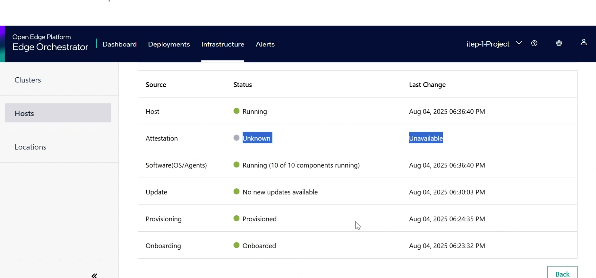
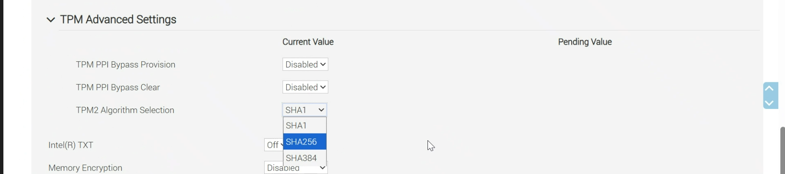

Trusted Compute Issues
======================

This section covers troubleshooting of Trusted Compute issues for EMF.

* `Failure of the Trusted Compute plugin installation due to security pre-requisites compatibility. trusted-compute-compatible is not true on EMF UI>`__
* `Host Attestation status is Unknown and all the pods are up and running>`__
* `Verifier and Attestation Manager PODs have cordoned the node, and attestation PODs failed to transition to the ready state>`__ 
* `Attestation failed and overall trust is showing as failed on the UI>`__ 
* `trusted-workload POD status is not running>`__ 

**Symptom:** Failure of the Trusted Compute plugin installation due to security pre-requisites compatibility. trusted-compute-compatible is not true on EMF UI

**Solution:** To resolve this issue, ensure that the prerequisites are met. Full Disk Encryption (FDE) and Secure Boot (SB) must be enabled on the platform. Once these features are activated on the edge-node platform, the onboarding profile should also enable FDE and SB.
The fix needs to be implemented in two areas: first, enable the features on the platform (FDE, SB); second, ensure that the profile features are aligned. To recover from this condition, re-onboard your edge-node with the prerequisites enabled.
For details on the pre-requisites see :doc:`/user_guide/set_up_edge_infra/edge_node_onboard/prerequisites/index`.

**Symptom:** Host Attestation status is Unknown and all the pods are up and running.

**Solution:**
This issue may arise if the PCR banks on the TPM are not configured correctly. To resolve it, set the PCR bank of the TPM to SHA256 by changing the BIOS settings on the edge node.

**Symptom:** Verifier and Attestation Manager PODs have cordoned the node, and attestation PODs failed to transition to the ready state.

**Solution:** When verification of the system fails, the node where attestation failed will be cordoned to protect the system for security analysis.
To recover from this state, you must uncordon the node from the cluster controller.

Sample commands:

.. code-block:: bash

   # Check the status of nodes
   kubectl get nodes

   # Uncordon the node
   kubectl uncordon <node_name>

**Symptom:** Attestation failed and overall trust is showing as failed on the UI.

**Solution:** This issue could be caused by a failure in updated components or a change in the bill of material of the system. To mitigate and audit the full attestation report, the user can check the verifier POD log and details. To recover from this state, you can analyze the attestation report and update the BOM accordingly or revert the faulty component from the Bill Of Material (BOM) list.
To update the BOM, you can either delete and re-install the deployment package in question from the EMF UI or re-provision the edge node with the desired OS profile.

**Symptom:** trusted-workload POD status is not running.

**Solution:** this issue could be caused by a failure in following components. please follow following steps to debug it.
1. Verify CRD installation: The operator creates the ccruntime CRD as can be observed in the following command:

   .. code-block:: bash

      # Check if the CRD is installed
      kubectl get crd | grep ccruntime

   .. figure:: images/tc-wl-crd-installation.png
      :align: left
      :width: 750px
      :alt: verify CRD installation

2. Verify Runtime class.

   .. code-block:: bash

      # verify runtime class
      kubectl get runtimeclass | grep kata

   .. figure:: images/tc-wl-runtime-class-installation.png
      :align: left
      :width: 750px
      :alt: verify Runtime class
    

3. Verify TC VM launch after pod deployment: Once the pod gets deployed with the kata-qemu runtimeclass, verify the VM launch using the command below.

   .. code-block:: bash

      ps -aux | grep /opt/kata/bin/qemu-system-x86_64

   .. figure:: images/tc-vm-debug.png
      :align: left
      :width: 750px
      :alt: tc vm debug

4. Enable debug console for trusted VM

   To enable full debug logs for QEMU hypervisor, Kata runtime, and Kata agent:

   Follow the below mentioned steps.

   Edit the file:
   
   1. /opt/kata/share/defaults/kata-containers/configuration-qemu.toml

   2. In the respective sections ("[hypervisor.qemu]", "[runtime]", and "[agent]"), enable the debug configuration parameters.

   3. Check the journalctl logs of containerd:

      .. code-block:: bash

         # Check containerd logs
         sudo journalctl -xeu containerd