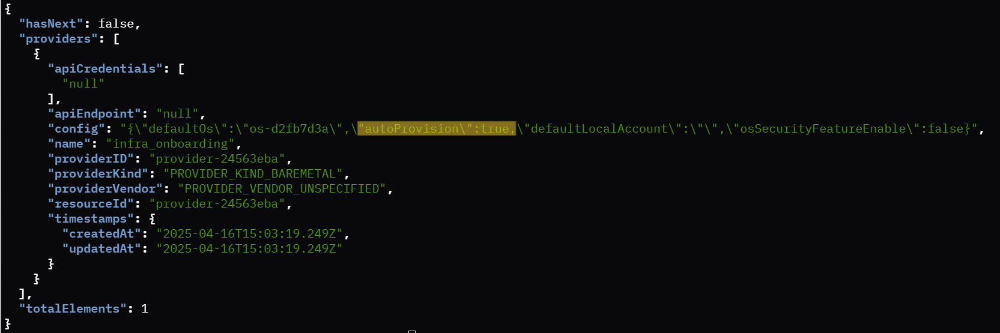

Example 4: Auto Provisioning
====================================================

During the virtual edge node onboarding process, the autoProvision setting determines how the system handles workflows initiation.
This setting can be configured during provider creation, with different approaches for enabling or disabling auto provisioning.

Scenario 1: Auto Provisioning Disabled (autoProvision: false)
---------------------------------------------------------------

By default the autoProvision is set to false, When auto provisioning is disabled the user needs to configure the provisioning steps for the profile through the Edge Orchestrator web UI.
To re-create a provider with "autoProvision: false," the user must use the manual POST API command as described below.

1. Export configs and nio_configs
~~~~~~~~~~~~~~~~~~~~~~~~~~~~~~~~~

.. code-block:: shell

    source ./config
    export PROJECT_API_USER="your_project_api_username"
    export PROJECT_API_PASSWORD="your_project_api_password"
    export PROJECT_NAME="your-project-name"

2. Obtain the JWT token
~~~~~~~~~~~~~~~~~~~~~~~~~~

.. code-block:: shell

    export JWT_TOKEN=$(curl --location --insecure --request POST "https://keycloak.${CLUSTER}/realms/master/protocol/openid-connect/token" \
    --header 'Content-Type: application/x-www-form-urlencoded' \
    --data-urlencode 'grant_type=password' \
    --data-urlencode 'client_id=system-client' \
    --data-urlencode "username="${PROJECT_API_USER}" \
    --data-urlencode "password="${PROJECT_API_PASSWORD}" \
    --data-urlencode 'scope=openid profile email groups' | jq -r '.access_token')

3. Sample configuration to delete existing provider
~~~~~~~~~~~~~~~~~~~~~~~~~~~~~~~~~~~~~~~~~~~~~~~~~~~~

.. code-block:: shell

    curl -X DELETE -H 'Accept: application/json' -H "Authorization: Bearer ${JWT_TOKEN}" --header "Content-Type: application/json" \
    https://api.${CLUSTER}/v1/projects/${PROJECT_NAME}/providers/{provider-a2a751f9}

4. Sample configuration to create Provider with AutoProvision Disabled
~~~~~~~~~~~~~~~~~~~~~~~~~~~~~~~~~~~~~~~~~~~~~~~~~~~~~~~~~~~~~~~~~~~~~~

.. code-block:: shell

    curl -X POST "https://api.${CLUSTER}/v1/projects/${PROJECT_NAME}/providers" -H "accept: application/json" \
    -H "Content-Type: application/json" -d '{"providerKind":"PROVIDER_KIND_BAREMETAL","name":"infra_onboarding", \
    "apiEndpoint":"xyz123", "apiCredentials": ["abc123"], "config": "{\"defaultOs\":\"os-51c4eba0\",\"autoProvision\":false}" }' \
    -H "Authorization: Bearer ${JWT_TOKEN}"

Sample Ubuntu\* OS Provider with `autoProvision: false`

Scenario 2: Auto Provisioning Enabled (autoProvision: true)
--------------------------------------------------------------

When auto provisioning is enabled, the onboarding process is streamlined, allowing for automatic workflow initiation. If the user employs the
`update_provider_defaultos.sh` script-based approach to create the provider, it will automatically set "autoProvision: true", facilitating seamless and efficient operations.

1. Export the config and nio_configs
~~~~~~~~~~~~~~~~~~~~~~~~~~~~~~~~~~~~~

.. code-block:: shell

    source ./config
    source ./scripts/nio_configs.sh

2. Set the desired OS provider
~~~~~~~~~~~~~~~~~~~~~~~~~~~~~~~~

**Edge Microvisor Toolkit**: Update the provider with Edge Microvisor Toolkit.

.. code-block:: shell

    ./scripts/update_provider_defaultos.sh microvisor

**Ubuntu OS**: Update the provider with Ubuntu os.

.. code-block:: shell

    ./scripts/update_provider_defaultos.sh ubuntu

Sample Ubuntu Provider with `autoProvision: true`

