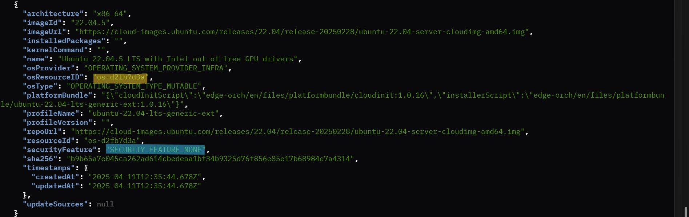
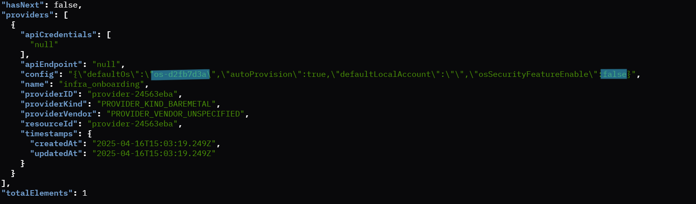
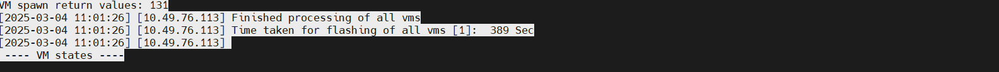

Deploy Virtual Edge Node
==============================

Update Provider Configuration
------------------------------

VM-based provisioning does not support secure boot. It needs `"securityFeature":"SECURITY_FEATURE_NONE"` during instance creation.
Use the following curl commands to create an OS instance and provider instance.

**Note:** The following commands are required to run initially when starting VM provisioning. These configurations are used for further VM provisioning.
Provider can be setup using following two options:

Option 1: Manual Provider Creation Using Curl Command
~~~~~~~~~~~~~~~~~~~~~~~~~~~~~~~~~~~~~~~~~~~~~~~~~~~~~~~

.. code-block:: shell

   cd vm-provisioning

1. Source the configuration file.

.. code-block:: shell

   source ./config

2. Obtain the JWT token.

.. code-block:: shell

   export JWT_TOKEN=$(curl --location --insecure --request POST 'https://keycloak.${CLUSTER}/realms/master/protocol/openid-connect/token' \
   --header 'Content-Type: application/x-www-form-urlencoded' \
   --data-urlencode 'grant_type=password' \
   --data-urlencode 'client_id=system-client' \
   --data-urlencode 'username=${PROJECT_API_USER}' \
   --data-urlencode 'password=${PROJECT_API_PASSWORD}' \
   --data-urlencode 'scope=openid profile email groups' | jq -r '.access_token')

**Important**: Before executing the Below JWT export command, ensure that all NIO configurations are properly exported as environment variables.
This step is crucial to ensure that the JWT export process has access to the necessary credentials and settings, preventing errors and ensuring smooth execution.

3. Select an existing OS profile, Sample ``osprofile id`` is **os-51c4eba0**
4. Sample configuration to delete a provider

.. code-block:: shell

   curl -X DELETE -H 'Accept: application/json' -H "Authorization: Bearer ${JWT_TOKEN}" --header "Content-Type: application/json" \
   https://api.${CLUSTER}/v1/projects/${PROJECT_NAME}/providers/{provider-a2a751f9}

5. Sample configuration to create a provider with an OS instance:

.. code-block:: shell

   curl -X POST "https://api.${CLUSTER}/v1/projects/${PROJECT_NAME}/providers" -H "accept: application/json" \
   -H "Content-Type: application/json" -d '{"providerKind":"PROVIDER_KIND_BAREMETAL","name":"infra_onboarding", \
   "apiEndpoint":"xyz123", "apiCredentials": ["abc123"], "config": "{\"defaultOs\":\"os-51c4eba0\",\"autoProvision\":true}" }' \
   -H "Authorization: Bearer ${JWT_TOKEN}"

Option 2: Automated Provider Creation Using Script
~~~~~~~~~~~~~~~~~~~~~~~~~~~~~~~~~~~~~~~~~~~~~~~~~~~~~

This `update_provider_defaultos.sh` script is designed to automate the process of updating the default OS profile in a provider and enable auto provisioning
for virtual edge nodes. It interacts with a cloud API to manage OS profiles and providers, ensuring that the correct OS is set as the default for provisioning.

**Auto Provisioning**: The new provider is configured with autoProvision set to true, enabling automatic provisioning of virtual edge nodes.

Before running the script, export the configuration variables from config and nio_configs.sh

.. code-block:: shell

    source ./config
    source ./scripts/nio_configs.sh

To execute the script, use the following command:

.. code-block:: shell

    /bin/bash update_provider_defaultos.sh [os_type]

Replace [os_type] with the desired OS profile, such as Edge Microvisor Toolkit or Ubuntu\* OS.

Example Commands
~~~~~~~~~~~~~~~~~~

**Edge Microvisor Toolkit**: Update the provider with Edge Microvisor Toolkit.

.. code-block:: shell

    ./scripts/update_provider_defaultos.sh microvisor

**Ubuntu OS**: Update the provider with Ubuntu OS.

.. code-block:: shell

    ./scripts/update_provider_defaultos.sh ubuntu

VMs Creation with Scripts
-------------------------

Currently, VM onboarding and provisioning are supported only for OS profiles (Ubuntu\* OS with Edge Microvisor Toolkit) where the security feature is set to `SECURITY_FEATURE_NONE`,
and the selected OS profile must be set as the default in the provider config.

Standalone VMs Creation
--------------------------

This section provides instructions for creating one or more virtual machines (VMs) on an Edge Orchestrator using predefined scripts from the host machine where the VMs will be created.

VMs Creation with Interactive Flow (IO)
------------------------------------------

To create a specified number of VMs, execute the following command:

.. code-block:: shell

   chmod +x ./scripts/create_vm.sh
   ./scripts/create_vm.sh <NO_OF_VMS>

NO_OF_VMS: Replace this placeholder with the actual number of VMs you wish to create.

**Note:** You can press Ctrl+C to cancel the ongoing VM provisioning process, whether it is in progress or completed.

VMs Creation with Non-Interactive Onboarding Flow (NIO)
----------------------------------------------------------

To create VMs using the Non-Interactive Onboarding flow, you have two options:

NIO Flow without Custom Serial Numbers:
~~~~~~~~~~~~~~~~~~~~~~~~~~~~~~~~~~~~~~~~~~

Use this option to automatically generate random serial numbers for each VM.

.. code-block:: shell

   chmod +x ./scripts/create_vm.sh
   ./scripts/create_vm.sh <NO_OF_VMS> -nio

NO_OF_VMS: Replace this placeholder with the actual number of VMs you wish to create.
-nio: This option enables the Non Interactive Onboarding flow.

NIO Flow with Custom Serial Numbers:
~~~~~~~~~~~~~~~~~~~~~~~~~~~~~~~~~~~~

Use this option to specify custom serial numbers for each VM.

.. code-block:: shell

   chmod +x ./scripts/create_vm.sh
   ./scripts/create_vm.sh <NO_OF_VMS> -nio -serials=<serials>

**-serials=**: Provide a comma-separated list of serial numbers for each VM. The number of serials must match the number of VMs specified.

Example Commands:
~~~~~~~~~~~~~~~~~

Automatically generate random serial numbers

.. code-block:: shell

   chmod +x ./scripts/create_vm.sh
   ./scripts/create_vm.sh 3 -nio

Specify custom serial numbers

.. code-block:: shell

   chmod +x ./scripts/create_vm.sh
   ./scripts/create_vm.sh 3 -nio -serials=VM112M01,VM112M02,VM113M01

**Note:** You can press Ctrl+C to cancel the ongoing VM provisioning process, whether it is in-progress or completed.

Already provisioned VMs or ongoing provisioning VMs shall be deleted.

Provisioning Complete
---------------------

Upon successful provisioning with Ubuntu OS, the following log will appear on your terminal: `UbuntuOS provision complete`

.. figure:: ./images/UbuntuOS_Provision.png
  :alt: Ubuntu OS provisioning completed

Upon successful provisioning with Edge Microvisor Toolkit, the following log will appear on your terminal: `Edge Microvisor Toolkit provision complete`

